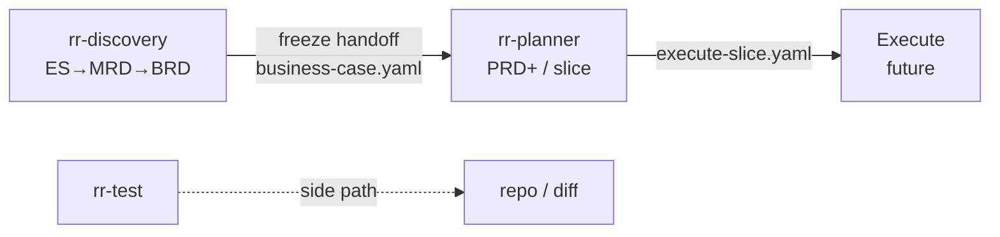

# RRRaw (rrraw)

**Version:** 0.0.4-rc-2  
**License:** Unlicense (see repo root `LICENSE`)

Flag-driven **Discover → Plan → (Execute)** freeze chain plus independent **test excellence** — phase agents, no slash commands.

## Why

RRRaw is a meta-dev framework (BMAD/GSD class) with different principles:

- **Proactive deduction over interrogation** — the agent infers and proposes; humans confirm or correct. Ceremony questions are a failure mode.
- **Automation over ceremony** — freeze, pins, and ship locks are mechanical so judgment stays on product decisions, not wiki genealogy.
- **Simpler process + better outcomes** — not replace company bureaucracy with AI bureaucracy.
- **Outcome = revenue and cheap change** — docs and code are instruments. Software that makes more money and is cheaper to maintain/change is the goal; artifacts are not.

Versioning lives on the Discover→Plan→(Execute) spine only: shared track + dual docs/product patches so ships stay consistent and cheap to change — not so the wiki has a hobby genealogy. Side paths (humanize, test) never mint versions. Law: [`refs/planning/baselines.md`](refs/planning/baselines.md).

## Skills

| Skill | Path | Role | Boundary |
|-------|------|------|----------|
| **rr-discovery** | [`skills/rr-discovery/`](skills/rr-discovery/README.md) | ES→MRD→BRD cascade + `business-case.yaml` freeze | Not PRD, RICE, stories, or architecture authorship |
| **rr-planner** | [`skills/rr-planner/`](skills/rr-planner/README.md) | PRD+ / spine / slice freeze from frozen business-case | Entry gate: frozen BRD + handoff; no Discover work |
| **rr-test** | [`skills/rr-test/`](skills/rr-test/README.md) | Assess, find gaps, write/fix tests, triage flaky | Orthogonal to Discover/Plan; no planning docs / versions |

## Pipeline



Versioning (track / docs patch / product patch / pins) is owned by the Discover→Plan→(Execute) spine only. `rr-test` and `rr-humanize` do not load or mint versions.

No slash commands. Invoke skills with flags or clear natural language; details live in each skill README.

## Quick start

```
rr-discovery --setup
rr-discovery --discover
```
→ Bootstrap `docs/` (incl. PR-scoped `validate_planning` check) then run Discover through BRD freeze.

```
rr-planner --prd
```
→ After freeze: compose PRD+ (entry gate must pass).

```
rr-test --assess --scope diff
```
→ Quality verdict for changed production code.

Flags, actions, and gates → each skill’s [README](skills/rr-discovery/README.md).

## Components

| Kind | Path | Role |
|------|------|------|
| Skills | `skills/rr-discovery/`, `skills/rr-planner/`, `skills/rr-test/` | Public flag-driven APIs |
| Planning agents | `agents/planning/` | Compose, research, challenge Task agents |
| Test agents | `agents/test/` | Assess, gaps, write, fix, flaky, … |
| Validate | `scripts/validate_planning*` | Planning artifact shape / ledger checks (PR CI via setup) |
| Shared refs | `refs/planning/` | Ledger, baselines, contracts (flow skills only for versioning) |

`skills/docs/rr-humanize/` is an internal prose helper (cascade humanize gate) — not a top-level skill; no version mint.

## Install

### Cursor

1. Ensure the **ai-plugins** marketplace is added and points at this repository’s **root** (not only the plugin folder).
2. Install plugin **rrraw** (RRRaw) from that marketplace.

### Claude Code

1. `/plugin marketplace add <repo-root-url-or-path>`
2. `/plugin install rrraw@ai-plugins`

### Local plugin dir (Claude Code)

```bash
claude --plugin-dir ./plugins/rrraw
```

(Run from the **ai-plugins** repo root, or pass an absolute path to `plugins/rrraw`.)

## Manifests

- Cursor: `.cursor-plugin/plugin.json`
- Claude Code: `.claude-plugin/plugin.json`

Both use `name: rrraw` matching the directory name under `plugins/`.

Plugin Spec (Why / What / When / Philosophy / UX / Constraints): [INTENT.md](INTENT.md).
