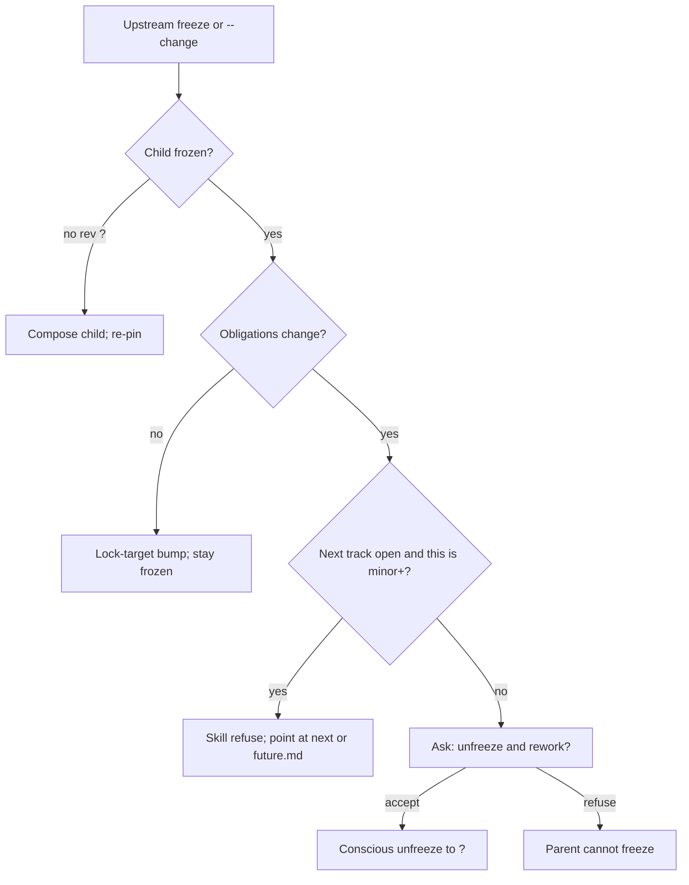

# baselines

**Owner:** Shared `major.minor` track, independent product/docs patches, freeze pins, unlock policy, `status.yaml`, `agent.plan.md`, and `future.md`. Skill is the only writer of those artifacts. CI does not mint or classify major/minor.

**Load when:** Every resolve (status-first pick); freeze / `--change` / open-next; compose frontmatter (`track`, `doc_rev`, `pins`).

Item identity, spec, and PRD `status` stay in [doc-standards/item-schema.md](doc-standards/item-schema.md). This ref does not change them. Tickets and technical docs stay out — they target `track` + item id.

## Version model

Humans talk in **0.1 / 0.2**. Product and docs share that track. Patches diverge. Major/minor are a **skill decision** after explicit confirm, not a CI bump.

| Token | What it is | Example |
|-------|------------|---------|
| **Track** | Shared `major.minor`. What everyone means by "version 0.1." | `0.1` |
| **Product patch** | Independent. Display `product 0.1.3`. | `0.1.3` or `0.1.0?` |
| **Docs patch** | Independent. Display `docs 0.1.7`. | `0.1.7` or `0.1.0?` |
| **Per-doc rev** | Pin identity only (`BRD@2` + digest). Not the human version. | `2` or `?` |
| **`?`** | Unshipped / unfrozen. Compose does not increment. | `docs 0.2.0?`, `rev: ?` |

Rejected: shared patch across product and docs; per-doc SEMVER as the human version; CI minting major/minor.

## Project knowledge vs session-state

`session-state.json` is a **resume checkpoint** (per phase dir). It is not project knowledge.

Durable record uses **three files** under `{PROJECT_ROOT}/docs/`:

| File | Role |
|------|------|
| `rrr-status.yaml` | **Summary only** — human glance + routing (`phase`, `track`, `product`/`docs`, `discovery_complete`, `docs_shipped`, `next`, one-line `summary`). Skill refreshes on phase transitions / freeze / ship. **Not** validator pin input. Do **not** write `levels`, digests, `challenge`, or `mint_hash` here. |
| `discovery/status.yaml` | **Detail** — ES/MRD/BRD revs, digests, pins, challenge, `mint_hash` |
| `plan/status.yaml` | **Detail** — PRD revs, digests, pins, challenge, `mint_hash` |

Any agent in the repo must see them. First key on each is the injection version from [agent-config.md](agent-config.md) (`claude_config_version` on summary is authoritative for SoT sync).

### `rrr-status.yaml` (summary)

```yaml
claude_config_version: 1
track: "0.1"
phase: discovery          # discovery | plan | complete
product: "0.1.0?"
docs: "0.1.0?"
discovery_complete: false
docs_shipped: false
product_status: "?"
next: null                # "0.2" when open
summary: "Discovering — BRD in progress"
```

### Phase `status.yaml` (detail)

```yaml
claude_config_version: 1
track: "0.1"
product: "0.1.3"          # or 0.1.0?
docs: "0.1.7"             # or 0.1.0?
next: null                # or "0.2"
docs_shipped: true
product_status: shipped   # or "?"
mint_hash: "sha256:..."   # skill-written; mismatch → HAND_BUMP
levels:
  executive-summary:      # discovery stems only under docs/discovery/
    rev: 2                # integer frozen; "?" unfrozen
    digest: "sha256:..."  # of this doc's items.json records; null while "?"
    pins: {}
  mrd:
    rev: 1
    digest: "sha256:..."
    pins:
      executive-summary: { rev: 2, digest: "sha256:..." }
  brd:
    rev: "?"
    digest: null
    pins: {}
  # plan/status.yaml levels contain prd only
next_levels: {}           # populated iff next is set; same per-doc shape
challenge:                # current track; next_challenge mirrors next_levels
  prd:
    status: dirty         # dirty | clean-shallow | clean-deep | dirty-accepted
    depth: deep           # shallow | deep; last scan depth; null if never scanned
    scanned_digest: "sha256:..."  # items.json records hash; null if never scanned
next_challenge: {}
```

| Field | Rule |
|-------|------|
| `claude_config_version` | Last `injection.version` synced into root agent SoT. Not part of `mint_hash`. Summary file is authoritative for sync. |
| `track` | `major.minor` only. Skill mints after confirm. Hand-edit → `HAND_BUMP`. |
| `product` / `docs` | Same track prefix + independent patch. Trailing `?` = that line unshipped. Mirrored on summary. |
| `phase` / `summary` | Summary-only. Skill refreshes on freeze / handoff / ship. |
| `next` | At most one unshipped next track. `null` if none. |
| `docs_shipped` | `true` only after current-track docs freeze/ship. Unlock gate reads this. |
| `product_status` | `"?"` until product ships. Skill refuses ship while docs still `?`. Not part of `mint_hash`. |
| `mint_hash` | Phase detail only. SHA-256 of canonical `track`, `product`, `docs`, `next`, `docs_shipped`, `levels`, `next_levels`. Skill writes it on every mint. |
| `discovery_complete` | Summary-only. `true` after Discover BRD freeze + valid `business-case.yaml`. Plan entry requires this (or equivalent frozen BRD + handoff). |
| `levels` | Current `track` stems for **this phase**. Child `pins` name the immediate parent stem. Plan PRD pins against Discovery BRD digests across dirs. |
| `next_levels` | Next-track revs/pins when `next` is set. Empty object otherwise. |
| `challenge` / `next_challenge` | Per-doc attestation on phase detail. Not part of `mint_hash`. Never a validator FAIL. Skill is the only writer. |

Digest = `sha256:` + hex of canonical JSON for that doc’s `items.json` records (`sort_keys`, no whitespace variance). Do not hash markdown (frontmatter would be circular).

Skill writes phase detail on first compose, freeze / lock-target / confirmed major-minor, and challenge attestation updates. Skill refreshes summary on phase transition / freeze / ship. Compose does not write either.

### Challenge attestation

Four-state per stem. Absent row = never scanned = `dirty`. `dirty-accepted` applies to **this digest only**. `status.yaml` `challenge:` is the only aggregate — no `challenge-index.yaml`.

| `status` | Meaning |
|----------|---------|
| `dirty` | Never scanned, digest moved, or last scan had findings — not accepted |
| `clean-shallow` | Last **shallow** scan had zero open findings for this doc **and** `scanned_digest == levels.<doc>.digest` |
| `clean-deep` | Last **deep** scan had zero open findings for this doc **and** `scanned_digest == levels.<doc>.digest` |
| `dirty-accepted` | User explicitly closed this snapshot without a `clean-*` scan |

`clean-*` means "last scan of this digest found nothing open" — not "doc finished." Freeze stays independent of challenge status.

Each row also stores `depth: shallow | deep` from the last scan. Stamp the same `depth` in `{stem}.challenge.report.md` frontmatter.

Invalidation (skill, not compose, not the challenge agent):

- After compose persist of a doc: if that doc’s `challenge.status` is `clean-shallow`, `clean-deep`, or `dirty-accepted` → set `dirty`. Dirtiness fans out to the edited doc only — dual-stub partners stay `dirty` until their own address pass.
- After freeze mint: if `levels.<doc>.digest` ≠ `challenge.<doc>.scanned_digest` → `dirty`.
- Stamp after challenge persist: `clean-shallow` or `clean-deep` iff no findings for that stem, `scanned_digest` recorded from the live digest, and `depth` matches the run.

Do not store `open_ids` in status (per-run `bs-001` is not stable). Challenge is post-freeze attestation — Gates 1–7 do not wait on it.

### `viability_stale` (session-state)

AI field on binding levels (`executive-summary`, `mrd`) in `session-state.json`. Set `true` when compose changes load-bearing ES facts: premises, verdict prose, consent/privacy constraints, named Musts. Orchestrator must not treat a stale `proceed` as current. Gate 7 re-sit clears it. Challenge may `flag_risk` but never rewrites `viability[]`.

## Frontmatter (cascade docs)

Replace stub `version: 1` + `traces_from`. Each `{level}.md`:

```yaml
---
doc_type: prd
track: "0.1"
doc_rev: 2          # or "?"
pins:
  brd: { rev: 2, digest: "sha256:..." }
created: 2026-06-24T10:00:00Z
---
```

ES `pins: {}`. Child pins the immediate parent only. `doc_rev` must match `status.yaml` for that stem on this track.

## Layout / directory fork

`docs/discovery/` holds Discover cascade docs; `docs/plan/` holds PRD+. Parking + tripwire stay at `docs/`. When a next major.minor opens, fork under the **phase** dir: `docs/discovery/{next}/` and/or `docs/plan/{next}/`. Global summary always at `docs/rrr-status.yaml`.

```
{PROJECT_ROOT}/docs/
  rrr-status.yaml          # SUMMARY
  agent.plan.md            # tripwire
  future.md / tech.md / later.md
  discovery/
    status.yaml            # DETAIL — ES/MRD/BRD
    session-state.json
    executive-summary.md | mrd.md | brd.md
    business-case.yaml
    items.json | …
    0.2/                   # only once next is open
  plan/
    status.yaml            # DETAIL — PRD
    session-state.json
    prd.md | …
    0.2/
```

`--output-dir` for Discover next-track work is `{PROJECT_ROOT}/docs/discovery/{next}/`; Plan → `docs/plan/{next}/`. Validator pointed at a track subdir loads that phase’s `status.yaml` from the phase parent. Plan pin checks load Discovery status across dirs for BRD parent digests.

Legacy `docs/plans/` is a **read fallback once** (same class as old `docs/planning/`) — announce new defaults; no auto-migrate.

## Unlock gate (skill policy, not CI)

Not a validator FAIL. Not an auto-bump. `agent.plan.md` refuses non-patch version work and routes here. This skill classifies.

```
0.1 docs ?        → refuse open 0.2; refuse ship product 0.1
0.1 docs shipped  → MAY open 0.2.0? after confirm
0.2 docs ?        → refuse minor+ on 0.1; refuse open 0.3
```

One unshipped next track. Scripts **never** increment `track` / major / minor. Only this skill mints those after explicit confirm.

## Patch-only current (skill, not CI)

While next is open, current accepts **patches only**. Large 0.1 work while 0.2 is planned → redirect to next or `future.md`. Login defect on 0.1 → patch, allowed.

Classification is judgment: patch vs redirect-to-next vs open-next vs conscious unfreeze. Do not invent CI codes for those.

## Freeze mint (skill)

Compose does not increment anything. After Gate 6+7 pass for a level:

1. Add the level to `frozen_levels` ([cascade.md](../../skills/rr-planner/refs/cascade.md)).
2. Set `levels[doc].rev`: `?` → `1` on first freeze; integer stays until lock-target or unfreeze.
3. Write `digest` from that doc’s items.
4. Child freeze copies parent `{ rev, digest }` into `pins`.
5. Docs patch++. Product patch unchanged.
6. Recompute `mint_hash`.
7. If `levels.<doc>.digest` ≠ `challenge.<doc>.scanned_digest` → set that stem `dirty`.

Major/minor (`track`, `next`) only on confirm — never on this mint. Challenge attestation is not a freeze gate.

## Upstream change: three paths

`--change` or parent freeze while children exist:

1. **Frozen children, no obligation change** → lock-target bump: parent `rev`++, new digest, docs patch++, product patch unchanged, children **stay frozen**, refresh their pins to the new parent digest.
2. **Frozen children, obligations break** → conscious unfreeze (ask). If the change is minor+ **and** `next` exists → redirect; do not unfreeze 0.1.
3. **Children already `?`** → compose the child; re-pin on freeze. Child freeze still requires parent frozen (CI: `PARENT_UNFROZEN`).



No auto-unfreeze. No bump on compose. No silent rediscover.

## `future.md` — one inbox

One `{PROJECT_ROOT}/docs/future.md`. Not validator input. No item ids, no SEMVER. Meeting residue / no go-nogo.

| Rule | |
|------|--|
| Never auto-promote | Opening next **offers** to promote matching sections; user confirms. |
| Next track already open | Notes for that track go to `{level}.notes.yaml` under the phase `{next}/` dir, not `future.md`. |
| What belongs here | Unassigned, or beyond-next. |

Rejected: `future/` folder; per-track future files.

## `tech.md` — mechanism capture

One `{PROJECT_ROOT}/docs/tech.md`. Same tier as `later.md` / `future.md`. **Not validator input.** No item ids, no gates, never composed into ES/MRD/BRD/PRD.

| Rule | |
|------|--|
| Passive | Skill appends freely when mechanism-level detail surfaces (shalls, AC, integration points, NFR mechanism, error-handling specifics, requirement-explosion overflow). No periodic maintenance; rr-planner does not re-read it on later passes. |
| Not a cascade doc | Never mint item ids; never run Gates 1–7 against this file. |

## `later.md` — deferred-topic parking lot

One global `{PROJECT_ROOT}/docs/later.md`. **Not validator input.** No item ids.

| Rule | |
|------|--|
| Passive | Skill writes freely when the user defers a topic ("discuss later"). No periodic maintenance; no auto-incorporate. |
| Distinct from notes | `{level}.notes.yaml` is active/addressed-then-deleted for off-level answers on a specific doc. `later.md` is a global parking lot. |

## `agent.plan.md` contract

Project file `{PROJECT_ROOT}/docs/agent.plan.md`. Always-on for every agent. Body template and the one load line: [agent-config.md](agent-config.md).

Must:

- Refuse non-patch version changes (`track`, major/minor, open-next, unfreeze, frozen `rev` / pins); load this skill. Do not duplicate pairing / unlock tables.
- Do not delete `agent.plan.md`. Treat stripping the root load line as a pairing break: restore (append only), do not proceed with the delete.
- On a new root agent SoT (`AGENTS.md`, `GEMINI.md`, …), add the same one line. Do not invent `.mdc` rule files. Do not rewrite those files’ bodies.

Skill on each resolve (does not wait for the agent to notice): if `rrr-status.yaml` or `agent.plan.md` exists, emit/refresh `agent.plan.md` when `injection.version` advanced, append the load line to every existing root SoT, set `claude_config_version` on summary. Idempotent.

Do not dump pairing rules into `CLAUDE.md` / `AGENTS.md` (more than that one line). Do not create `AGENTS.md` (or successors) from nothing.

## CI / validator — mechanical only

`validate_planning.sh` may FAIL these. It must not mint versions and must not FAIL "this looks like a minor."

| Code | Condition |
|------|-----------|
| `PARENT_UNFROZEN` | Frozen child (`rev` integer), parent still `?` |
| `STALE_PIN` | Frozen child pin ≠ live parent digest/rev |
| `REV_WHILE_OPEN` | Integer `rev` / `doc_rev` on a level that is still unfrozen (`?` in status, or absent from `frozen_levels`) |
| `HAND_BUMP` | Frozen rev / pins / `track` (canonical mint payload) changed without a matching `mint_hash` — includes a human editing major.minor in `status.yaml` |

Removed from CI (never emit): `NEXT_LOCKED`, `CURRENT_NOT_PATCH`. Independent patches (`product 0.1.3` / `docs 0.1.7`) are valid. `future.md` and `agent.plan.md` are not cascade input. `challenge` / `next_challenge` are judgment/process only — never a script FAIL.

## What this ref does not do

- Tickets, technical docs, or `.mdc` rule files.
- A second `lines.yaml`.
- Shared patch; per-doc SEMVER as the human version.
- CI minting or failing major/minor policy.
- Auto-unfreeze; bump on compose; silent rediscover.
