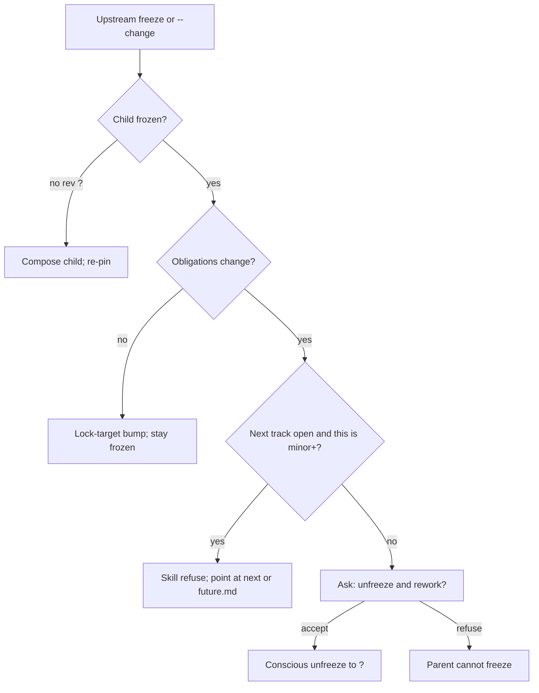

# baselines

**Owner:** Shared `major.minor` track, independent product/docs patches, freeze pins, unlock policy, product-ship ceremony, `status.yaml`, `agent.plan.md`, and `future.md`. Skill is the only writer of those artifacts. CI does not mint or classify major/minor — it FAILs mechanical integrity (`HAND_BUMP`, …) on **PRs**.

**Load when:** Every resolve (status-first pick); freeze / `--change` / open-next; compose frontmatter (`track`, `doc_rev`, `pins`); product ship / unlock.

**Package index:** [README.md](README.md) — versioning is Shared under `refs/planning/`; **flow skills only** (Discover, Plan, future Execute). Non-loaders: `rr-humanize`, git helpers, `rr-test`. No skill-local `baselines.md` stubs.

Item identity, spec, PRD `status` / `priority`, and Effort provenance stay in [doc-standards/item-schema.md](doc-standards/item-schema.md). This ref does not change them. Tickets and technical docs stay out — they target `track` + item id.

## Version model

Humans talk in **0.1 / 0.2**. Product and docs share that track. Patches diverge. Major/minor are a **skill decision** after explicit confirm, not a CI bump.

| Token | What it is | Example |
|-------|------------|---------|
| **Track** | Shared `major.minor`. What everyone means by "version 0.1." | `0.1` |
| **Product patch** | Independent. Display `product 0.1.3`. | `0.1.3` or `0.1.0?` |
| **Docs patch** | Independent. Display `docs 0.1.7`. | `0.1.7` or `0.1.0?` |
| **Per-doc rev** | Pin identity only (`BRD@2` + digest). Not the human version. | `2` or `?` |
| **`?`** | Unshipped / unfrozen. Compose does not increment. | `docs 0.2.0?`, `rev: ?` |

Glance from `rrr-status.yaml`: `track`, `docs`, `product`, `next` open?, `docs_shipped`, `product_status`.

### SemVer map (track vs patch)

Market SemVer: patch = compatible; minor = additive public surface; major = break. RRRaw maps **track** to the rare minor/major *product-line* decision; **docs/product patches** absorb compatible churn. Pins = content-addressed lineage (not paragraph tags).

| Token | Bumps when | Does **not** bump when |
|-------|------------|-------------------------|
| **Track** `major.minor` | Intentional release / planning fork: new capability set, breaking obligation rewrite, or confirmed “next product line” | Grammar; additive PRD item; bugfix; lock-target pin refresh |
| **Docs patch** `track.N` | Freeze, lock-target, or skill-classified obligation-**preserving** doc change (style, clarify, additive item that does not break upstream/downstream pins) | Product code changes |
| **Product patch** `track.N` | Ship hotfix / bugfix / non-breaking behavior on same track | Doc-only edits |
| **doc_rev** (integer) | Freeze / lock-target identity of that stem | Human “version” talk |

| Change | Classify as | Version effect |
|--------|-------------|----------------|
| Grammar / style; same meaning | **docs patch** (or compose-only if still `rev: ?`) | `docs`++; pins unchanged if digest obligations identical path; else lock-target |
| Bug fix in code; no behavior contract change | **product patch** | `product`++; track unchanged |
| New PRD item; upstream BRD still satisfied; no child obligation break | **docs patch** on same track | `docs`++; PRD `rev`++ on freeze/lock-target — **not** `0.1→0.2` |
| Same item’s meaning changes so architecture/AC/downstream break | unfreeze or **open-next** (skill confirm) | track minor/major — rare |
| First implementation of a selected slice ships | product ship ceremony | `product`++; may set `docs_shipped` / lock per below |

**Anti-pattern `0.999`:** Treating every small PRD edit as a track minor. That misuses **track**. Hundreds of PRD/doc edits stay on `0.1.x` docs / `0.1.y` product. Humans still say “we’re on 0.1.” Track minor is a **fork decision** (one unshipped `next` at a time).

**Additive PRD ≠ track bump:** Doc addition is not a docs-breaking change. Behavior risk is priced at **product** ship / slice selection — not by minting `0.2` every time someone types a new requirement.

### Control split

| Who | May bump | May not |
|-----|----------|---------|
| Skill (Discover or Plan; future Execute) | **docs patch** on freeze / lock-target / obligation-preserving edit; **product patch** on ship/hotfix; **track** open-next after confirm | hand-edit `track` / frozen rev / pins / mint_hash |
| Compose | prose/items only; no version fields | all version fields |
| PR CI (setup-installed) | FAIL on `HAND_BUMP`, `STALE_PIN`, … | mint or classify track major/minor |

### Rejected patterns

| Pattern | Why reject |
|---------|------------|
| Shared patch across product and docs | Patches must diverge independently |
| Per-doc SEMVER as the human version | Humans talk track; `doc_rev` is pin identity only |
| CI minting or failing major/minor policy | Skill judgment after confirm; CI is mechanical only |
| Inline forward markers (`[0.2]` tags inside living `0.1` files) | Dual systems, digest death, noisy diffs, task races, per-doc SemVer creep |
| Every PRD / doc tweak → track minor | **0.999 failure mode** — use docs patch instead |
| Immutable full-tree CoW (`docs/0.1/`, `docs/0.2/` as default) | Heavy duplication; weak patch-on-shipped-track — compliance zip-per-release only, not default |

## Project knowledge vs session-state

`session-state.json` is a **resume checkpoint** (per phase dir). It is not project knowledge.

Durable record uses **three files** under `{PROJECT_ROOT}/docs/`:

| File | Role |
|------|------|
| `rrr-status.yaml` | **Summary only** — human glance + routing (`phase`, `track`, `product`/`docs`, `discovery_complete`, `docs_shipped`, `next`, one-line `summary`). Skill refreshes on phase transitions / freeze / ship. **Not** validator pin input. Do **not** write `levels`, digests, `challenge`, or `mint_hash` here. |
| `discovery/status.yaml` | **Detail** — ES/MRD/BRD revs, digests, pins, challenge, `mint_hash` |
| `plan/status.yaml` | **Detail** — PRD revs, digests, pins, challenge, `mint_hash`, optional **slice** freeze unit |

Any agent in the repo must see them. First key on each is the injection version from [agent-config.md](agent-config.md) (`claude_config_version` on summary is authoritative for SoT sync).

### `rrr-status.yaml` (summary)

```yaml
claude_config_version: 1
track: "0.1"
phase: discovery          # discovery | plan | complete
product: "0.1.0?"
docs: "0.1.0?"
discovery_complete: false
docs_shipped: false
product_status: "?"
next: null                # "0.2" when open
summary: "Discovering — BRD in progress"
```

### Phase `status.yaml` (detail)

```yaml
claude_config_version: 1
track: "0.1"
product: "0.1.3"          # or 0.1.0?
docs: "0.1.7"             # or 0.1.0?
next: null                # or "0.2"
docs_shipped: true
product_status: shipped   # or "?"
mint_hash: "sha256:..."   # skill-written; mismatch → HAND_BUMP
levels:
  executive-summary:      # discovery stems only under docs/rr/{track}/discovery/
    rev: 2                # integer frozen; "?" unfrozen
    digest: "sha256:..."  # of this doc's items.json records; null while "?"
    pins: {}
    # maturity: code-extraction | draft   # optional; from-code reverse only
  mrd:
    rev: 1
    digest: "sha256:..."
    pins:
      executive-summary: { rev: 2, digest: "sha256:..." }
  brd:
    rev: "?"
    digest: null
    pins: {}
  # plan/status.yaml levels contain prd only
  # optional Plan slice freeze (selection unit — not a sprint):
  # slice:
  #   id: slice-001
  #   status: frozen | draft | ?
  #   requirement_ids: [PRD-3.1, PRD-3.2]
  #   execute_kernel: execute-slice.yaml
  #   architecture_rev: draft | integer
next_levels: {}           # populated iff next is set; same per-doc shape
challenge:                # current track; next_challenge mirrors next_levels
  prd:
    status: dirty         # dirty | clean-shallow | clean-deep | dirty-accepted
    depth: deep           # shallow | deep; last scan depth; null if never scanned
    scanned_digest: "sha256:..."  # items.json records hash; null if never scanned
next_challenge: {}
```

| Field | Rule |
|-------|------|
| `claude_config_version` | Last `injection.version` synced into root agent SoT. Not part of `mint_hash`. Summary file is authoritative for sync. |
| `track` | `major.minor` only. Skill mints after confirm. Hand-edit → `HAND_BUMP`. |
| `product` / `docs` | Same track prefix + independent patch. Trailing `?` = that line unshipped. Mirrored on summary. |
| `phase` / `summary` | Summary-only. Skill refreshes on freeze / handoff / ship. |
| `next` | At most one unshipped next track. `null` if none. |
| `docs_shipped` | `true` only after current-track docs freeze/ship. Unlock gate reads this. |
| `product_status` | `"?"` until product ships. Skill refuses ship while docs still `?`. Not part of `mint_hash`. |
| `mint_hash` | Phase detail only. SHA-256 of canonical `track`, `product`, `docs`, `next`, `docs_shipped`, `levels`, `next_levels`. Skill writes it on every mint. Slice block is **not** part of `mint_hash` (selection stamps independently). |
| `discovery_complete` | Summary-only. `true` after Discover BRD freeze + valid `business-case.yaml`. Plan entry requires this (or equivalent frozen BRD + handoff). |
| `levels` | Current `track` stems for **this phase**. Child `pins` name the immediate parent stem. Plan PRD pins against Discovery BRD digests across dirs. Optional `maturity: code-extraction \| draft` on Discover stems — mirror of cascade frontmatter; freeze mint **refuses** while any stem is `code-extraction`. |
| `slice` | Plan detail only. Optional. Selected requirement ids + path to `execute-slice.yaml`. Language: **slice / phase**, never sprint. Future release/version grouping may reference frozen slices — not designed here. |
| `next_levels` | Next-track revs/pins when `next` is set. Empty object otherwise. |
| `challenge` / `next_challenge` | Per-doc attestation on phase detail. Not part of `mint_hash`. Never a validator FAIL. Skill is the only writer. |

Digest = `sha256:` + hex of canonical JSON for that doc’s `items.json` records (`sort_keys`, no whitespace variance). Do not hash markdown (frontmatter would be circular).

Skill writes phase detail on first compose, freeze / lock-target / confirmed major-minor, and challenge attestation updates. Skill refreshes summary on phase transition / freeze / ship. Compose does not write either.

### Challenge attestation

Four-state per stem. Absent row = never scanned = `dirty`. `dirty-accepted` applies to **this digest only**. `status.yaml` `challenge:` is the only aggregate — no `challenge-index.yaml`.

| `status` | Meaning |
|----------|---------|
| `dirty` | Never scanned, digest moved, or last scan had findings — not accepted |
| `clean-shallow` | Last **shallow** scan had zero open findings for this doc **and** `scanned_digest == levels.<doc>.digest` |
| `clean-deep` | Last **deep** scan had zero open findings for this doc **and** `scanned_digest == levels.<doc>.digest` |
| `dirty-accepted` | User explicitly closed this snapshot without a `clean-*` scan |

`clean-*` means "last scan of this digest found nothing open" — not "doc finished." Freeze stays independent of challenge status.

Each row also stores `depth: shallow | deep` from the last scan. Stamp the same `depth` in `{stem}.challenge.report.md` frontmatter.

Invalidation (skill, not compose, not the challenge agent):

- After compose persist of a doc: if that doc’s `challenge.status` is `clean-shallow`, `clean-deep`, or `dirty-accepted` → set `dirty`. Dirtiness fans out to the edited doc only — dual-stub partners stay `dirty` until their own address pass.
- After freeze mint: if `levels.<doc>.digest` ≠ `challenge.<doc>.scanned_digest` → `dirty`.
- Stamp after challenge persist: `clean-shallow` or `clean-deep` iff no findings for that stem, `scanned_digest` recorded from the live digest, and `depth` matches the run.

Do not store `open_ids` in status (per-run `bs-001` is not stable). Challenge is post-freeze attestation — Gates 1–7 do not wait on it.

### `viability_stale` (session-state)

AI field on binding levels (`executive-summary`, `mrd`) in `session-state.json`. Set `true` when compose changes load-bearing ES facts: premises, verdict prose, consent/privacy constraints, named Musts. Orchestrator must not treat a stale `proceed` as current. Gate 7 re-sit clears it. Challenge may `flag_risk` but never rewrites `viability[]`.

## Frontmatter (cascade docs)

Replace stub `version: 1` + `traces_from`. Each `{level}.md`:

```yaml
---
doc_type: prd
track: "0.1"
doc_rev: 2          # or "?"
# maturity: code-extraction | draft   # optional; Discover from-code only
pins:
  brd: { rev: 2, digest: "sha256:..." }
created: 2026-06-24T10:00:00Z
---
```

ES `pins: {}`. Child pins the immediate parent only. `doc_rev` must match `status.yaml` for that stem on this track. Optional `maturity` is **doc-level** (`code-extraction` \| `draft`) — not an item `spec`; omit on interview-sourced docs. Mirror on `levels.<stem>.maturity`.

## Layout / directory fork

**Default (version-first):** every track lives under `docs/rr/{track}/`. Discover cascade → `docs/rr/{track}/discovery/`; Plan → `docs/rr/{track}/plan/`. Parking + tripwire + summary live at `docs/rr/`. When a next major.minor opens, create `docs/rr/{next}/{phase}/` — **not** phase-subdir forks.

```
{PROJECT_ROOT}/docs/rr/
  rrr-status.yaml          # SUMMARY
  agent.plan.md            # tripwire
  future.md / tech.md / later.md
  tasks/                   # reserved (global; not CoW on open-next)
  0.1/
    discovery/
      status.yaml          # DETAIL — ES/MRD/BRD
      session-state.json
      executive-summary.md | mrd.md | brd.md
      business-case.yaml
      items.json | …
    plan/
      status.yaml          # DETAIL — PRD + optional slice
      session-state.json
      prd.md
      architecture.md      # standing spine (invariants)
      constitution.md      # optional; when arch_doc_mode: split
      deltas/              # per-feature ADR-lite deltas
        <feature-id>.md
      execute-slice.yaml   # compact 5-field Execute kernel (on slice freeze)
      …
  0.2/                     # next track once opened
    discovery/
    plan/
```

`--output-dir` for Discover next-track work is `{PROJECT_ROOT}/docs/rr/{next}/discovery/`; Plan → `docs/rr/{next}/plan/`. Validator pointed at a phase dir loads that phase’s `status.yaml` (walk-up). Plan pin checks load Discovery status across sibling phase dirs for BRD parent digests.

**Rejected (old phase-first CoW):** forking under `docs/discovery/{next}/` or `docs/plan/{next}/` while keeping current track flat at `docs/{phase}/`. That model mixed phase-first roots with version subdirs and forced awkward CoW. `--setup` `layout migrate` moves those trees into version-first. Legacy `docs/plans/` / `docs/planning/` also migrate (no announce-only).

## Unlock gate (skill policy, not CI)

Not a validator FAIL. Not an auto-bump. `agent.plan.md` refuses non-patch version work and routes here. Flow skill classifies.

```
0.1 docs ?        → refuse open 0.2; refuse ship product 0.1
0.1 docs shipped  → MAY open 0.2.0? after confirm
0.2 docs ?        → refuse minor+ on 0.1; refuse open 0.3
```

One unshipped next track. Scripts **never** increment `track` / major / minor. Only this skill mints those after explicit confirm.

## Product ship ceremony (skill)

Locks the relationship between **docs freeze/ship**, **product line**, and **unlock**. Skill is the only writer. Not a CI classification.

| Field | Meaning |
|-------|---------|
| `docs_shipped` | `true` only after current-track docs are freeze-complete enough to ship against (Discover BRD + Plan obligations for the ship unit). Unlock gate reads this. |
| `product_status` | `"?"` until product ships; then `shipped` (or host-equivalent). Skill refuses product ship while docs still carry trailing `?` on the docs line **or** `docs_shipped` is false. |
| `product` patch | ++ on ship / hotfix / non-breaking product change on this track. |

Ceremony (same track):

1. **Docs ready** — stems frozen (or slice freeze for Plan handoff); `docs` line has no trailing `?` for the ship unit; skill sets `docs_shipped: true` when docs are the ship baseline.
2. **Product ship** — after confirm: `product` patch++; set `product_status: shipped`; refresh summary. Recompute phase `mint_hash` where product/docs are in the mint payload.
3. **Unlock / open-next** — allowed only when unlock gate permits (`docs_shipped` and confirm). Opening `next` does **not** auto-ship product.
4. **Hotfix on shipped track** — `product` patch++ only; track unchanged; docs unchanged unless a docs patch is also classified.

Refuse:

- Ship product while `docs` is still `?` or `docs_shipped: false`
- Open next track while current docs are still `?`
- Hand-edit `docs_shipped` / `product_status` / `product` / `track` without skill mint → PR `HAND_BUMP` when mint payload drifts

Future **Execute** owns the product-ship mint path on this same ceremony — do not invent a third version model.

## Patch-only current (skill, not CI)

While next is open, current accepts **patches only**. Large 0.1 work while 0.2 is planned → redirect to next or `future.md`. Login defect on 0.1 → patch, allowed.

Classification is judgment: patch vs redirect-to-next vs open-next vs conscious unfreeze. Do not invent CI codes for those.

## Freeze mint (skill)

Compose does not increment anything. After Gate 6+7 pass for a level **or** after Plan **slice** freeze gates:

**Refuse** whole-doc freeze mint (and `business-case.yaml`) while any composed Discover stem has `maturity: code-extraction` (frontmatter or `levels.<stem>.maturity`). Promote to `draft` first (`skills/rr-discovery/refs/from-code.md`). Validator: `CODE_EXTRACTION_FROZEN` / `INVALID_MATURITY`.

### Whole-doc freeze (Discover stems; optional Plan structure lock)

1. Add the level to `frozen_levels` (`skills/rr-planner/refs/cascade.md` for Plan; Discover cascade for ES/MRD/BRD).
2. Set `levels[doc].rev`: `?` → `1` on first freeze; integer stays until lock-target or unfreeze.
3. Write `digest` from that doc’s items.
4. Child freeze copies parent `{ rev, digest }` into `pins`.
5. Docs patch++. Product patch unchanged.
6. Recompute `mint_hash`.
7. If `levels.<doc>.digest` ≠ `challenge.<doc>.scanned_digest` → set that stem `dirty`.

### Slice freeze (Plan)

Primary Plan freeze unit is a **selected requirement slice**, not the whole PRD table.

1. Smell-gate AC (`req-smell` + WWAS) pass or explicit hold.
2. Same-sitting architecture exists for selected capabilities (spine and/or feature deltas); architecture rev may be `draft`.
3. Write/overwrite `docs/rr/{track}/plan/execute-slice.yaml` (5-field kernel + pins) — [output-formats.md](output-formats.md).
4. Stamp `plan/status.yaml` `slice:` with requirement ids + kernel path; do **not** shrink/delete deferred requirement rows.
5. Unfreeze classify for obligation breaks stays the existing three-path table almost as-is.
6. Whole-PRD freeze remains optional structure lock only — not the default handoff to Execute.

Major/minor (`track`, `next`) only on confirm — never on this mint. Challenge attestation is not a freeze gate.

## Upstream change: three paths

`--change` or parent freeze while children exist:

1. **Frozen children, no obligation change** → lock-target bump: parent `rev`++, new digest, docs patch++, product patch unchanged, children **stay frozen**, refresh their pins to the new parent digest.
2. **Frozen children, obligations break** → conscious unfreeze (ask). If the change is minor+ **and** `next` exists → redirect; do not unfreeze 0.1.
3. **Children already `?`** → compose the child; re-pin on freeze. Child freeze still requires parent frozen (CI: `PARENT_UNFROZEN`).



No auto-unfreeze. No bump on compose. No silent rediscover.

## `future.md` — one inbox

One `{PROJECT_ROOT}/docs/rr/future.md`. Not validator input. No item ids, no SEMVER. Meeting residue / no go-nogo.

| Rule | |
|------|--|
| Never auto-promote | Opening next **offers** to promote matching sections; user confirms. |
| Next track already open | Notes for that track go to `{level}.notes.yaml` under `docs/rr/{next}/{phase}/`, not `future.md`. |
| What belongs here | Unassigned, or beyond-next. |

Rejected: `future/` folder; per-track future files.

## `tech.md` — Discover mechanism parking

One `{PROJECT_ROOT}/docs/rr/tech.md`. Same tier as `later.md` / `future.md`. **Not validator input.** No item ids, no gates, never composed into ES/MRD/BRD/PRD.

| Rule | |
|------|--|
| Discover | Skill may append early mechanism notes that surface before Plan owns architecture. |
| Plan | **Does not** author product AC, integration contracts, or ADRs here. Standing truth = `docs/rr/{track}/plan/architecture.md` (+ optional `constitution.md`) and `docs/rr/{track}/plan/deltas/<feature-id>.md`. |
| Not a cascade doc | Never mint item ids; never run Gates 1–7 against this file. |

## `later.md` — deferred-topic parking lot

One global `{PROJECT_ROOT}/docs/later.md`. **Not validator input.** No item ids.

| Rule | |
|------|--|
| Passive | Skill writes freely when the user defers a topic ("discuss later"). No periodic maintenance; no auto-incorporate. |
| Distinct from notes | `{level}.notes.yaml` is active/addressed-then-deleted for off-level answers on a specific doc. `later.md` is a global parking lot. |

## `agent.plan.md` contract

Project file `{PROJECT_ROOT}/docs/rr/agent.plan.md`. Always-on for every agent. Body template and the one load line: [agent-config.md](agent-config.md).

Must:

- Refuse non-patch version changes (`track`, major/minor, open-next, unfreeze, frozen `rev` / pins); load this skill. Do not duplicate pairing / unlock tables.
- Do not delete `agent.plan.md`. Treat stripping the root load line as a pairing break: restore (append only), do not proceed with the delete.
- On a new root agent SoT (`AGENTS.md`, `GEMINI.md`, …), add the same one line. Do not invent `.mdc` rule files. Do not rewrite those files’ bodies.

Skill on each resolve (does not wait for the agent to notice): if `rrr-status.yaml` or `agent.plan.md` exists, emit/refresh `agent.plan.md` when `injection.version` advanced, append the load line to every existing root SoT, set `claude_config_version` on summary. Idempotent.

Do not dump pairing rules into `CLAUDE.md` / `AGENTS.md` (more than that one line). Do not create `AGENTS.md` (or successors) from nothing.

## CI / validator — mechanical only (PR-scoped)

`validate_planning.sh` may FAIL these. It must not mint versions and must not FAIL "this looks like a minor."

**Authoritative scope is the pull request.** Framework `--setup` wires a host-repo PR check ([setup.md](setup.md)). Local pre-push / agent preflight may run the same script optionally — local-only validation is **insufficient**. Hand-edit of mint fields must fail the **merge**, not hope an agent notices.

| Check | When | Owner |
|-------|------|-------|
| `HAND_BUMP`, `STALE_PIN`, `PARENT_UNFROZEN`, `REV_WHILE_OPEN`, maturity codes | **PR** CI on planning paths (`docs/rr/**`) | `validate_planning*` installed by **framework setup** |
| Same codes | Optional local pre-push / agent preflight | same script |
| patch vs open-next vs unfreeze | On `--change` / upstream freeze | skill judgment |
| Unlock / product ship policy | Before minting `next` or shipping product | skill (not CI classification) |

| Code | Condition |
|------|-----------|
| `PARENT_UNFROZEN` | Frozen child (`rev` integer), parent still `?` |
| `STALE_PIN` | Frozen child pin ≠ live parent digest/rev |
| `REV_WHILE_OPEN` | Integer `rev` / `doc_rev` on a level that is still unfrozen (`?` in status, or absent from `frozen_levels`) |
| `HAND_BUMP` | Frozen rev / pins / `track` (canonical mint payload) changed without a matching `mint_hash` — includes a human editing major.minor in `status.yaml` |
| `INVALID_MATURITY` | Frontmatter or `levels.<stem>.maturity` set to a value other than `code-extraction` \| `draft` |
| `CODE_EXTRACTION_FROZEN` | Integer `rev` / `doc_rev` while maturity is still `code-extraction` |

Removed from CI (never emit): `NEXT_LOCKED`, `CURRENT_NOT_PATCH`. Independent patches (`product 0.1.3` / `docs 0.1.7`) are valid. `future.md` and `agent.plan.md` are not cascade input. `challenge` / `next_challenge` are judgment/process only — never a script FAIL.

## What this ref does not do

- Tickets, technical docs, or `.mdc` rule files.
- A second `lines.yaml`.
- Shared patch; per-doc SEMVER as the human version; inline `[N.M]` forward markers; track bump on every PRD edit.
- CI minting or failing major/minor policy.
- Auto-unfreeze; bump on compose; silent rediscover.
- Version procedure in `rr-humanize`, git helpers, or `rr-test`.
