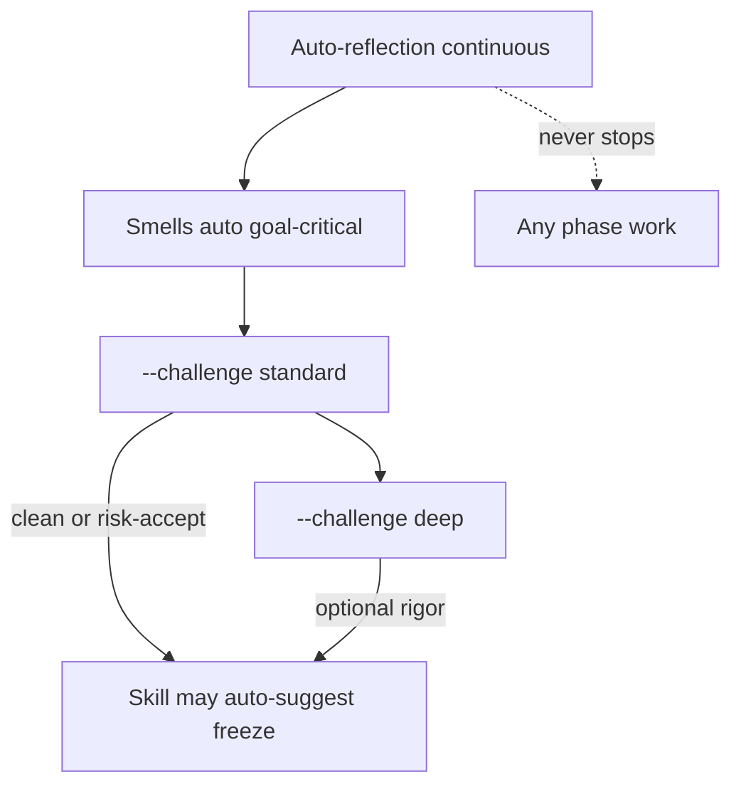

# challenge-layers

**Owner:** Shared challenge tier contract for Discover and Plan — what runs always, what `--challenge` means, when freeze may be auto-suggested.

**Load when:** Every resolve that may advance, freeze-suggest, or run `--challenge` / `--challenge deep`. Skill writers stamp attestation per [baselines.md](baselines.md).

**Plugin UX SoT:** [INTENT.md](../INTENT.md) UX (user is not process-owner). This file is **runtime enforcement** — tiers, auto-close, freeze-suggest precondition — not the Spec essay.

**Does not:** Replace smells with challenge. Does not invent a report format for auto-reflection. Does not make challenge attestation a CI FAIL.

## Layers

| Layer | Trigger | Coverage | Report | Auto-close |
|-------|---------|----------|--------|------------|
| **Auto-reflection** | Every phase transition / sub-section (constant, like smells) | Goal-serve + obvious divergence | One-line / session reflection — **no** formal report | Allowed when alternatives unlikely; record reasoning |
| **Smells** | Always-on checkers (Plan `req-smell` + Discover equivalents + goal-critical auto checks) | Most critical, fast | Inline / gate table | Same |
| **`--challenge`** (standard) | User flag **or** skill stage-exit / pre-freeze suggest | All **relevant** load-bearing claims | Full `{stem}.challenge.report.md` | Same; founder question when ≥2 plausible alternatives (delivery per effective mode) |
| **`--challenge deep`** | Explicit `deep` | Every detail / exhaustive | Full report + deeper attestation | Same |

Smell-clean ≠ challenged. Auto-reflection ≠ `--challenge`. User `--challenge` is **standard** unless `deep` is explicit — never call bare `--challenge` “the deep pass.”

## Mode ↔ attestation map

Keep status enums stable for validators. Modes map in docs:

| Challenge mode | `status.yaml` `depth` | Clean stamp when zero open findings |
|----------------|----------------------|-------------------------------------|
| **standard** (`--challenge`) | `shallow` (legacy name = standard scan) | `clean-shallow` |
| **deep** (`--challenge deep`) | `deep` | `clean-deep` |

Legacy helper stamps may write `clean` — treat as standard-clear for freeze-suggest until rewritten. Risk-accept stamp: `dirty-accepted` after AskQuestion (this digest only).

## Assumption auto-close

If only one alternative is above “unlikely,” skill may close with recorded reasoning. If two or more remain plausible → founder question required (delivery per **effective** `question_mode`). Never silent-pick among peers. Applies to both Discover and Plan.

**Post-report probe:** After a challenge report persists, if a finding offers ≥2 plausible remediations (A\|B\|C table or peer alternatives) → surface ≤ `preferences.questions_per_cycle` per address cycle **before absorb** — delivery per **effective** `question_mode` (see below). Never silent-apply the agent-preferred letter, then re-attest. Re-attest only after the absorb batch for that stem.

**Delivery (post-report + cheaper-first step 3):** Honor **effective** `payload.question_mode` — not hardcoded `AskQuestion`.

| Effective mode | Surface |
|----------------|---------|
| `ask` | `AskQuestion` |
| `text` | Inline chat — full context, recommendation, numbered/bulleted options |
| `auto` | Per-question heuristic ([goal-anchor.md](../../skills/rr-planner/refs/goal-anchor.md) § Question patterns): long question (>~120 chars) and/or long option label (>~60 chars) and/or ≥3 substantive options → **text**; short confirm / yes-no / ≤3 terse single-select → **AskQuestion**; multi-paragraph remediation fork → **text** always |

Record chosen `delivery` on each clarification and raw-history turn.

## Stop-rule: no challenge while queues are open

Do **not** run `--challenge` / re-attest / challenge `Task` while either is true:

1. `checkpoint.pending_clarifications` is non-empty, **or**
2. Open challenge findings await absorb (worklist still has addressable items)

`questions_per_cycle` does not override this — answering a QPC batch is not a challenge trigger ([output-formats.md](output-formats.md)).

## Cheaper-first ladder (before challenge Task)

Before spawning a challenge `Task`, drain the open set in this order:

1. **Auto-close** — assumption auto-close when only one plausible alternative
2. **Reword** — clarify / tighten without a new AskQuestion when the gap is wording
3. **Founder question** — ≤ `preferences.questions_per_cycle` per address cycle; delivery per **effective** `question_mode` (post-report table above — not hardcoded `AskQuestion`)
4. **Absorb batch** — apply remediations from answers / auto-closes into docs. **Batch:** multi-doc → parallel mutators / compose `Task`; session-state via `scripts/session_state.sh` only (**read-budget:** never full-file `Read` of `session-state.json`)
5. **Then** — one challenge pass (standard or deep as resolved)

### Pre-Task probe

Before challenge `Task`: open founder questions = 0 **and** remediation batch applied **and** `status.yaml` digests + (when present) `slice.requirement_ids` match live files / `execute-slice.yaml` pins ([baselines.md](baselines.md) pre-challenge sync)? If no → do not spawn challenge; Next Up = drain Qs / remediations / sync ([progress.md](progress.md)).

## Freeze suggest (skill policy)

**Mint freeze** mechanical gates stay in [baselines.md](baselines.md) (independent of attestation for CI).

**Skill may auto-suggest freeze** only when:

1. Mechanical Fail-freeze / handoff conditions pass (or explicit hold where allowed), **and**
2. Load-bearing stems for this freeze unit are **standard-clear** (`clean-shallow` / legacy `clean`) **or** user completed **risk-accept** AskQuestion → `dirty-accepted`, **and**
3. Auto-reflection / standing red flags / upstream reopen do not block (skill-local refs)

Deep is optional rigor — never required for freeze-suggest. Smell-clean alone never unlocks freeze-suggest.

**Quality veto:** Refuse freeze-by-user-say-so over open quality debt without risk-accept. Do not incentivize skip in Next Up.

## Work advance vs freeze mint

| Move | Rule |
|------|------|
| **Work advance** on draft upstream | Allowed when skill judges the **cited solid subset** load-bearing-stable |
| Upstream change after advance | Skill auto-marks downstream impact and drives review — user does not remember to re-check |
| **Mint** frozen child / handoff | Full parent freeze still required (`PARENT_UNFROZEN`) |

## Dogfood scope filter

When slice / session posture is **dogfood** (minimum usable demo — not full MVP or external-pattern slice):

| Fork class | Plan action |
|------------|-------------|
| **Demo-blocking** | Surface for founder decision (delivery per effective `question_mode`) |
| **Volume / edge** (scale, rare race, exhaustive matrix) | **Auto-defer** — no `pending_clarifications` queue entry; note in challenge report as **Deferred (later phase)** |
| **Cheap future hook** (design cost low at Execute) | **Auto-defer** with report note as **Future-ready (Execute)** — not blocking Plan Q&A |

Under dogfood, post-report probe **does not queue** volume/edge forks — auto-defer with report note regardless of delivery mode. Demo-blocking forks still surface per effective mode.

Judgment signals: user stated dogfood / demo slice / “minimum usable”; `execute-slice.yaml` `why` or session notes cite demo scope; standing constitution marks dogfood posture.

## Backward-chain

When the current level cannot support the real goal given parents, challenge **upstream** — do not bury as HOLD. Discover: MRD↔ES, BRD↔MRD. Plan: Plan→Discover reopen. Detail in skill `goal-anchor` / `cascade`.

## Done-when

- Orchestrator distinguishes all four layers; does not treat smells or auto-reflection as `--challenge`
- Freeze auto-suggest respects standard-clear or risk-accept
- Attestation stamps match the mode map above
- No challenge `Task` while `pending_clarifications` or open findings await absorb; cheaper-first ladder + pre-Task probe pass first
- Post-report ≥2 alternatives → founder question before absorb (delivery per effective `question_mode`); never silent-pick among peers
- Dogfood: volume/edge forks auto-deferred with report note — not queued
- Pre-challenge: digests + slice `requirement_ids` synced to live files
- QPC never treated as challenge cadence
