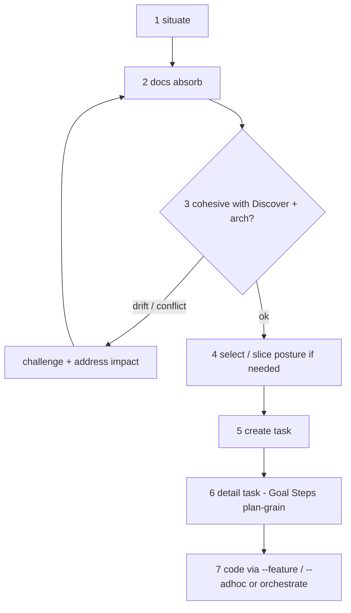

# intake

**Owner:** Shared situate + process pipeline for ad-hoc product intent on rr (and collapsed non_rr). Entry skills (`rr-planner --intake`, `rr-builder --intake`) bias pace and ownership; they do **not** waive stages.

**Load when:** Any `--intake` / NL idea / coverage check / “build X” on rr; direct `--feature` / `--adhoc` preflight; builder/planner absorb wrappers.

**Wrappers:** Planner `skills/rr-planner/refs/intake-absorb.md` (stages 2–4); builder `skills/rr-builder/refs/intake-absorb.md` (situate + peer planner for 2–4 when needed; continue 5–7 when unblocked). Post-pipeline runners: builder `skills/rr-builder/refs/feature.md` (planned) and `skills/rr-builder/refs/adhoc.md` (urgent wrap).

**Does not:** Replace Plan compose ceremony (`--prd` / `--change`); invent `docs/rr/` in non_rr; authorize code before stages 1–6 PASS on rr.

## Process pipeline (locked)

Even when the user’s goal is “just build it,” **code is the last step**. Entry skill only chooses who drives early stages and how aggressively to continue in-session.

| Stage | Must happen before code | Owns |
|-------|-------------------------|------|
| **1. Situate** | Match class + evidence | Shared this file |
| **2. Docs absorb** | PRD (± WWAS) + feature-delta when mechanism/Effort/UX-shape required; selection `_status_` | **Planner** via peer `skills/rr-planner/SKILL.md` entry (`--intake` / `--change`) — builder does **not** thin-patch Plan internals |
| **3. Challenge / impact** | If PRD/delta change is **not cohesive** with frozen Discover (ES/MRD/BRD/business-case) or standing **constitution / tech ADRs / architecture** → Plan challenge (cheaper-first) and/or Discover reopen candidates; mark downstream impact per [baselines.md](baselines.md); **block advance** until resolved, risk-accepted, or correctly routed | Planner challenge path via peer SKILL; builder **stops** and peer-invokes planner/discovery — does not code through it |
| **4. Select / slice** | Requirement selected (or open-slice posture consistent); no shrink-table cheats | Planner via peer SKILL |
| **5. Task create** | Task minted under open slice (rr) | Builder mint (or planner stub sync only) |
| **6. Task detail** | Goal, Steps grain, obligations citing docs/deltas — enough for plan→build; **plan stage** for first step when entering run | Builder |
| **7. Code** | Only after 1–6 PASS | `--feature` (default planned) / `--adhoc` (urgent) or orchestrate `--task`/`--step` |

**Hard stops before stage 7:** missing docs absorb; open Discover/Plan challenge that blocks; unaddressed architecture/obligation impact; no task; task too thin to run (no Goal/Steps).

**Forbidden on rr:** code-first; “docs later”; “obligation only in task body”; jumping `--feature`/`--adhoc` while stages 2–6 incomplete.

**non_rr:** no `docs/rr/` invent; host conventions; pipeline collapses to situate → mint → detail → code (no Plan cascade). `--feature` and `--adhoc` both collapse the same way.

**What “fast” means:** walk stages 1→7 in **one session** when changes are additive and no challenge block — not omit stages. Builder “write now” = continue through the pipeline to stage 7 without making the user re-type intent; still performs every stage. Urgency (`--adhoc`) = same gates, one-session bias.

## Cohesion + challenge (stage 3)

- Docs absorb alone is insufficient if the new/changed PRD surface **contradicts or orphans** Discover parents or standing architecture.
- Situate step 6 (Discover parents) + constitution/ADR check feeds stage 3.
- Stage 3 outcomes:
  - **Remediate in Plan** (delta/constitution cite, AC, selection) and continue
  - **Plan→Discover reopen** ranked candidates → `rr-discovery` (block builder code)
  - **Unfreeze / redirect-to-next** per baselines Ask
  - **Risk-accept** only via existing Plan challenge/risk-accept UX — still no silent code
- All impact fan-out (downstream stems, open tasks, frozen pins) addressed or explicitly queued before stages 5–7.

## Entry-skill bias

Same pipeline; bias = default pace and who authors early stages.

| Entry | Bias | Still required |
|-------|------|----------------|
| **rr-planner `--intake`** | Drive stages **1–4** (docs + challenge/impact + select); sync open tasks | Stop before code; Next Up builder `--feature` (default) or `--adhoc` (urgent) for 5–7 |
| **rr-builder `--intake`** | Stage 1 situate; peer-invoke planner SKILL for **2–4** when not PASS; prefer continue **5→7** when unblocked | On stage 3 judgment / unfreeze / Discover → peer planner/discovery; **no code until return + stages complete** |

**Anti-flip:** Planner never auto-codes. Builder never skips 2–6 to reach 7. Builder never `Read`s planner `refs/*` to perform Plan work — only peer `SKILL.md` entry (Task or Read+purpose).

## Situate (stage 1)

Run in order; record evidence. Report **pipeline stage reached** and **first blocking stage**.

| Step | Probe | Output |
|------|-------|--------|
| 1 | `docs/rr/` present? (`rrr-status.yaml` preferred) | `project_kind: rr \| non_rr` |
| 2 | Status / track / phase (`rrr-status.yaml`, plan `status.yaml`) | track, phase, open `next`? |
| 3 | PRD + selection (`_status_`) for intent surface | docs gap vs covered |
| 4 | Deltas / constitution / cited tech ADRs for mechanism & Effort | Plan absorb needed? |
| 5 | Tasks under open slice (`docs/rr/tasks/` or non_rr `.ai/tasks/`) | mint needed? thin Goal/Steps? |
| 6 | Discover parents (ES/MRD/BRD + business-case) + standing arch | cohesion risk for stage 3 |

### Match classes

| Class | Signal | Default next |
|-------|--------|--------------|
| **covered** | Intent already selected + delta/AC + runnable task | stage 6 detail if thin; else stage 7 / `--feature` (or `--adhoc` if urgent) |
| **docs_gap** | Missing or stale PRD/delta/AC/selection | stage 2 absorb via planner |
| **cohesion_risk** | Docs exist but contradict Discover parents or constitution/ADR | stage 3 challenge/impact via planner |
| **no_task** | Docs+select OK; no task under open slice | stage 5 mint (after 2–4 PASS) |
| **thin_task** | Task exists; Goal/Steps insufficient for plan→build | stage 6 detail |
| **non_rr** | No `docs/rr/` | collapse pipeline; never invent `docs/rr/` |
| **out_of_band** | Discover not frozen / Plan entry refused | route `rr-discovery` or entry-gate Ask |

## Absorb / Next Up UX

AskQuestion options = **legal next pipeline moves only** (never “skip to code”).

| Block | Next Up |
|-------|---------|
| Docs gap | planner `--intake` / `--change` (peer SKILL) |
| Discover/arch drift | planner challenge / discovery / baselines Ask |
| No task | mint (after docs OK) |
| Thin task | detail / plan stage |
| Ready (1–6 PASS) | **`--feature`** (default) or **`--adhoc`** (urgent) or orchestrate `--task`/`--step` |

Verifying phrases + close habits: [progress.md](progress.md). Challenge tiers: [challenge-layers.md](challenge-layers.md). Version/impact: [baselines.md](baselines.md).

## Peer SKILL invoke (cross-skill)

| Need | Do | Do not |
|------|----|--------|
| Builder needs Plan docs/challenge/select | **Invoke** `skills/rr-planner/SKILL.md` with purpose (`--intake` / `--change` / `--challenge`) via **Task** sub-agent **or** parent-inline `Read` of that **SKILL.md** + purpose payload | `Read skills/rr-planner/refs/*` from builder |
| Planner needs task situate / mint/detail / code readiness | **Invoke** `skills/rr-builder/SKILL.md` with purpose (`--intake` situate/5–6, or `--feature` / `--adhoc` when ready) same Task-or-entry pattern | `Read skills/rr-builder/refs/feature.md` / `adhoc.md` from planner |
| Shared situate/pipeline law | Both may `Read` this file | Duplicate pipeline law inside skill wrappers |

## Flag taxonomy (`--intake` / `--feature` / `--adhoc`)

| Flag | Intent | Pipeline |
|------|--------|----------|
| **`--intake`** | Situate + absorb (docs/challenge/select; builder may continue to task when unblocked) | Stages 1→… (planner stops at 4; builder may 1→7 via peer for 2–4) |
| **`--feature`** | **Planned** feature execute — Plan already has (or just absorbed) the surface | Stages **5–7** when **2–4 PASS**; else refuse → `--intake` / peer planner |
| **`--adhoc`** | **Urgent / unplanned** faster runner — still **full cohesion pipeline** (no stage skip); optimized one-session bias | Same gates as `--feature` on rr; framing + NL + urgency bias differ |

**Conflicts:** `--intake` + `--feature` + `--adhoc` mutually exclusive; all incompatible with lane flags and `--slice`/`--next`/`--step`.

**NL:**

- Idea / coverage / “add requirement” / docs unclear → `--intake`
- “Implement planned feature X” / PRD id / selected requirement → `--feature`
- “Urgent / unplanned / interrupt / ship this now” → `--adhoc` (still gates 2–4)

Direct `--feature`/`--adhoc` with incomplete pipeline → situate → if stages 2–4 FAIL, **stop** (Next Up `--intake` / planner), do not build.

Keep drive×scope `--task` and planner `--change` as scoped work — not substitutes for intake when docs/cohesion are open.

## Anti-triggers

- No code on rr before stages 1–6 PASS
- No invent `docs/rr/` in non_rr
- No silent-unfreeze / shrink table / sprint ceremony
- No skipping challenge when Discover/arch incoherent
- No builder thin-Plan absorb that bypasses planner Procedure
- No cross-skill `Read` of peer `refs/*` — peer `SKILL.md` entry only
- `--feature` / `--adhoc` never past task-validate; never invents missing Plan truth
- No “cascade edits = task obligations only” as a substitute for stages 2–4
