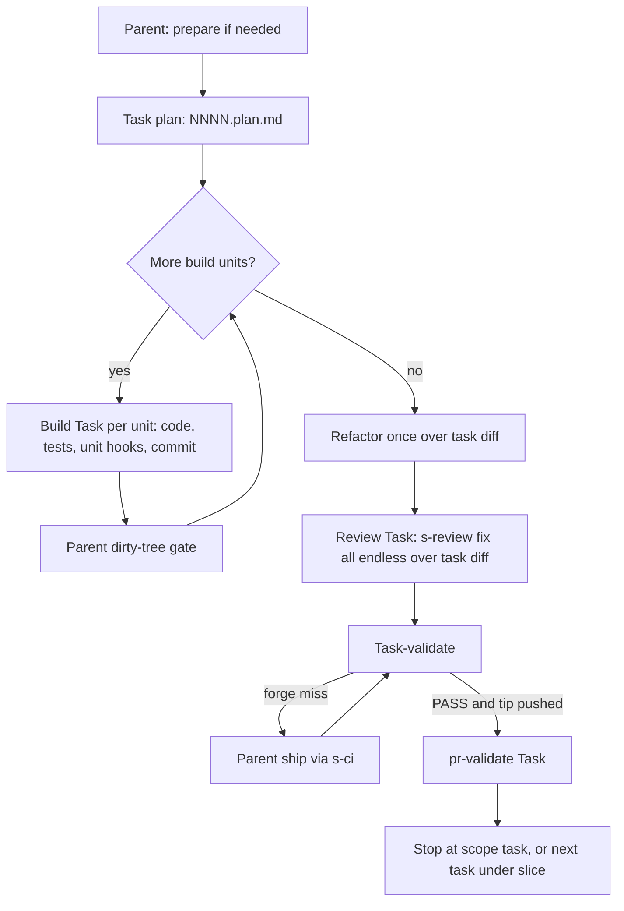

# Task run (isolation cell SoT)

**Audience:** `rr-builder` orchestrate when `drive: auto` ∧ `scope: task|slice` (includes lone `--task` / `--slice`). Parent loads **this ref** instead of the full isolated-step section in [slice-pipeline.md](slice-pipeline.md). Step-mode contracts in slice-pipeline stay for `--step`, `--next`, `--manual`, and mid-flight step granularity.

## When it applies

| Predicate | Detail |
|-----------|--------|
| Mode | `payload.mode: orchestrate` (not `--feature`, not handoff) |
| Drive × scope | `drive: auto` ∧ `scope: task` \| `slice` |
| Granularity | `pipeline_granularity: task` on `{NNNN}.md` (locked at first task-plan write) |
| Cursor | Inside a remaining **task** (not prepare / slice-validate / delivered) |

**Out of this cell:** `--feature` (parent-inline), `--manual`, `--auto --next`, `--auto --step`, explicit lane handoffs. Feature-mode parity is a tracked follow-up.

**Mid-flight:** A task started under `pipeline_granularity: step` finishes its in-flight step with step-mode rules ([slice-pipeline.md](slice-pipeline.md) task-step contracts). After that step closes, the task plan covers only **remaining** steps; earlier step sidecars stay as evidence.

## Pipeline shape (task granularity)

One task plan → **build** per unit (light verify only inside build) → one **refactor** over task diff → one **review** over task diff → one **task-validate** over task diff → optional **ship** → **pr-validate** when tip pushed.



Under this cell, plan `ship_after: step_validate` is treated as **`task_validate`** — one ship and one pr-validate at the end of the task.

## Ownership

| Owner | Owns |
|-------|------|
| **Parent** | resolve / mode / load; **prepare**; spawn phase Tasks per isolation table; **dirty-tree gate** after each return; **ship** / **s-ci** on `needs_ship`; **slice-validate** + delivered (`scope: slice` only) |
| **Phase executor** | `plan` \| `build` \| `refactor` \| `review` \| `validate` \| `pr_validate` per [executors/phase.md](executors/phase.md). Spec: [templates/phase-task.template.md](templates/phase-task.template.md). Returns `ok` \| `needs_ship` \| `failed`. Executor `ok` does **not** imply CI green. |

Parent does **not** implement build/refactor/review inline under this cell ([routing.md](routing.md) anti-pattern).

### Parent read-fence

The parent **never** Reads application source, test output, review reports, or CI logs. It consumes only Task returns (at most ~15 lines each) and `{NNNN}.md` cursor frontmatter. Token budget is not measurable in-session — enforcement is via this read-fence plus isolation thresholds below.

## Isolation policy (hybrid)

| Phase | Always Task | Inline when below threshold |
|-------|-------------|----------------------------|
| **build** | Yes — one Task per build unit | — |
| **review** | Yes | — |
| **pr-validate** | Yes | — |
| **plan** | >2 remaining steps, or allowlist/code exploration expected >8 files | Otherwise parent-inline |
| **refactor** | Build-touched files >10 or diff >400 LOC | Otherwise parent-inline; empty intersection → skip |
| **task-validate** | >8 Verify items or diff files >10 | Otherwise parent-inline |

**Override:** `payload.isolate: all` \| `auto` (default `auto`) — parsed in [input-resolution.md](input-resolution.md).

**Budget target:** Parent context ≤ ~200k tokens (proxy via thresholds + read-fence; not measured in-session).

## Loop

```
parent: prepare if needed
  → task plan ({NNNN}.plan.md) — Task or inline per threshold
  → while build_unit_index < unit count:
       spawn build Task for current unit
       ← ok | needs_ship | failed
       dirty-tree gate
  → refactor (Task or inline) over task diff
  → spawn review Task over task diff
  → task-validate (Task or inline)
       ← ok | needs_ship | failed
       needs_ship → parent ship → re-validate inline → dirty-tree gate
  → if open tip landed → spawn pr-validate Task
  → scope task → stop; scope slice → next task or slice-validate → delivered
```

### Dirty-tree gate

After each Task return (and after parent post-ship commit), parent runs `git status --porcelain`.

| Porcelain | Action |
|-----------|--------|
| **Non-empty** | Hard-stop: list dirty paths; do **not** spawn next phase; do **not** silent-commit. Carry-to-next does **not** waive this gate ([task-validate.md](task-validate.md) isolation exception). |
| **Empty** | Continue. |

**Success path:** phase executor **commits** work (app source + durable sidecars + cursor flags) **before** returning `ok` or `needs_ship`.

**Failure path:** executor must **not** commit; dirty tree expected; parent stops.

### `needs_ship`

Executor may return `needs_ship` after writing/committing a forge-miss task-validate report. Parent runs [ship.md](ship.md) → **s-ci** (push + draft-PR upsert need no confirm under `drive: auto` — [ship.md](ship.md) **Stop / anti-trigger**), re-runs task-validate **inline** (assessment only), commits cursor/validate, dirty-gates, then spawns **pr-validate** Task when an open tip was landed.

### Nested-skill leaf Tasks

The phase executor **is** the parent session for nested lane skills. Leaf Tasks those skills document (`refactor-collector`, tester agents, etc.) stay allowed. Executor MUST NOT re-invoke **rr-builder**, MUST NOT spawn sibling phase Tasks for a different phase, MUST NOT run `--add-endless-test`.

## Plan sizing

Each **build unit** must touch at most ~15 files. If a step in the remaining work is larger, the task plan **splits** it into multiple units so each build executor stays within ~200k context.

Task plan path: `{artifact_root}/{NNNN}.plan.md` — schema [plan-schema.md](plan-schema.md) **Task plan variant**.

## Cursor persistence (task-run fields)

Prefer extending `{NNNN}.md` frontmatter — no third parallel state file.

| Field | Where | Values / notes |
|-------|--------|----------------|
| `pipeline_granularity` | `{NNNN}.md` | `task` \| `step` — **locked** at first task-plan write; mid-flight step tasks keep `step` until that step closes |
| `builder_stage` | `{NNNN}.md` | Reused values: `prepare` \| `plan` \| `build` \| `refactor` \| `review` \| `task_validate` \| `ship` \| `pr_validate` \| `slice_validate` \| `delivered` |
| `task_plan_done` | `{NNNN}.md` | `true` \| `false` |
| `build_unit_index` | `{NNNN}.md` | 0-based index into task plan **Build units** |
| `task_build_base_sha` | `{NNNN}.md` | Commit SHA at **first build unit** start (`git rev-parse HEAD` before first build commit). SoT for refactor build-touched scope |
| `task_refactor_done` | `{NNNN}.md` | `true` \| `false` |
| `task_review_done` | `{NNNN}.md` | `true` \| `false` |
| `task_ship_done` | `{NNNN}.md` | `true` \| `false`; treat as `true` when `ship_after: never` |
| `task_pr_validate_done` | `{NNNN}.md` | `true` \| `false`; treat as `true` when skipped (`never` / carry-to-next) |
| `builder_stage` (mirror) | `task-summary.md` | Parent-only: set at plan handoff, ship, forge-landing push (`pr_validate`) and task close; phase executors never write `task-summary.md` |
| `active_ship_branch` | `task-summary.md` | Last resolved ship head ([feature-branch.md](feature-branch.md) / task plan Ship) |
| `ship_base_branch` | `task-summary.md` | Last resolved PR/MR base |

Update fields when a stage’s done-when passes — **before** looping or stopping.

## Probe order (task granularity)

First match wins — **next** stage for `scope: next` equivalent within task-run; head of remaining path for `scope: task` / `slice`.

1. **No pin-complete kernel / no `slice_id`** → stop or AskQuestion.
2. **Missing / incomplete prepare** → stage **prepare** → **s-prepare**.
3. **`task_plan_done` ≠ `true`** → **plan** (task plan `{NNNN}.plan.md`).
4. **`build_unit_index` < unit count** → **build** for current unit.
5. **All units built and `task_refactor_done` ≠ `true`** → **refactor** (task diff scope; see below).
6. **`task_refactor_done: true` and `task_review_done` ≠ `true`** → **review** (`--fix --all --endless`).
7. **`task_review_done: true`** → **task-validate** until PASS.
8. **While on task-validate** — [task-validate.md](task-validate.md) task-run inputs. Forge miss ∧ shippable ∧ `task_ship_done` ≠ `true` → parent **ship** → re-validate inline.
9. **PASS ∧ tip pushed** → **pr-validate** Task (skip when `never` / carry-to-next).
10. **Task boundary** — `scope: task` → stop; `scope: slice` → next task or **slice validate** → **delivered**.

### Task refactor scope

1. Resolve MR file list (s-review MR recipe).
2. Narrow to files touched since `task_build_base_sha` across all build units.
3. **Empty intersection** → skip with lean note; `task_refactor_done: true`.
4. Pass scope to **s-refactor** with `epoch_cap: 5`.

Missing `task_build_base_sha` when build ran → hard-stop cursor gap.

## Scope stop boundaries (task-run)

| `scope` | Stop when |
|---------|-----------|
| `task` | Active task reaches task-validate PASS + forge landing (+ pr-validate PASS when tip pushed). **Feature mode** (tracked follow-up) uses same boundary — no slice-validate. |
| `slice` | All remaining tasks complete task-run loop, then slice-validate PASS → delivered. |

Under task-run, final stop requires `{NNNN}.task-validate.md` on tip (or carry-to-next) — **not** the step-mode "both sidecars" rule ([task-validate.md](task-validate.md)).

## Stage pointers

Detailed done-when for inline phases still defer to [slice-pipeline.md](slice-pipeline.md) stage contracts where applicable. Task-run-specific validate/ship/pr-validate: [task-validate.md](task-validate.md), [ship.md](ship.md), [pr-validate.md](pr-validate.md). Feature branch: [feature-branch.md](feature-branch.md) **Task-run branch**.
