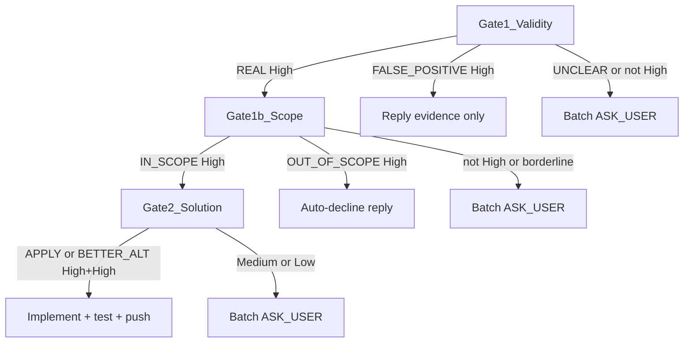

# MR comment triage and reply templates

Same evidence bar for human and bot/AI comments — never auto-apply bot suggestions without verifying in context.

## MR task scope derivation (once per run, before per-comment loop)

Before triaging individual comments, derive a one-line **task boundary** for the MR:

1. Read PR/MR title, description (summary above `---`), and any linked ticket via `gh pr view` or `glab mr view`.
2. Write the task boundary — used for all comments in this run. Example: *"Add retry logic to payment webhook handler."*

Gate 1b compares each comment to this boundary (runs only when Gate 1 = `REAL`):

| Scope verdict | Meaning | Next |
|---------------|---------|------|
| `IN_SCOPE` | Fits the MR's stated goal | Gate 2 — Solution |
| `OUT_OF_SCOPE` | Valid concern but not this MR's job | `DECLINE` with out-of-scope template; offer issue link when glab/jira is available |
| `FOLLOW_UP` | Valid but belongs in a separate ticket | `DECLINE` or batch `ASK_USER` at Medium/Low |

`OUT_OF_SCOPE` + High confidence → auto-reply with out-of-scope template (no code, no thread resolve).

## Three-gate triage flow

Apply gates in order for **each** comment. Complete the per-comment triage record (below) before any edit.



| Gate | Question | Outputs |
|------|----------|---------|
| **Gate 1 — Validity** | Is the reviewer's claim true in this codebase? | `REAL` / `FALSE_POSITIVE` / `UNCLEAR` |
| **Gate 1b — Task scope** | Even if true, does it belong in *this* MR's stated goal? | `IN_SCOPE` / `OUT_OF_SCOPE` / `FOLLOW_UP` |
| **Gate 2 — Solution** | If in scope, is the proposed fix (or best fix) correct? | `APPLY_AS_PROPOSED` / `BETTER_ALTERNATIVE` / `DECLINE` / `ASK_USER` |

Gate 1b runs only when Gate 1 = `REAL`. Gate 2 runs only when scope = `IN_SCOPE` (or `FOLLOW_UP` if user later opts in).

## Evidence steps (in order)

1. Read anchored code and surrounding context; check mitigations, reachability, and whether the claim is already handled.
2. Wider scope: callers/callees relevant to the claim; same pattern in **MR-changed files**. Expand beyond the MR only when correctness of the fix requires it.
3. If the comment proposes a fix, treat it as a hypothesis — compare to alternatives and project patterns.

## Gate 1 — Validity verdict

| Verdict | Meaning | Next |
|---------|---------|------|
| `REAL` | Evidence confirms a real issue or valid improvement | Gate 1b — Task scope |
| `FALSE_POSITIVE` | Wrong assumption, already mitigated, or not a bug | Reply with evidence; **do not resolve** thread |
| `UNCLEAR` | Cannot confirm with High confidence after evidence steps | `ASK_USER` (batch) |

## Gate 2 — Solution disposition

Runs only when scope = `IN_SCOPE` (or `FOLLOW_UP` if user opted in).

| Disposition | When |
|-------------|------|
| `APPLY_AS_PROPOSED` | Proposed fix is correct and matches project patterns |
| `BETTER_ALTERNATIVE` | Real issue, but a different fix is clearly better |
| `DECLINE` | Real-ish request but pure taste nitpick that does not match standards, or would add complexity without value |
| `ASK_USER` | See ask triggers below |

## Comment-specific confidence criteria

Define High/Medium/Low per gate — not the merge-conflict pattern bar.

| Level | Validity ("is real") | Solution ("fix is right") |
|-------|----------------------|---------------------------|
| **High** | Claim confirmed in anchored code + surrounding context; mitigations checked | Single fix matches project patterns; alternatives clearly inferior OR proposed fix verified correct |
| **Medium** | Plausible but incomplete context; pattern exists elsewhere in MR | Two+ reasonable fixes; proposed fix conflicts with a project pattern |
| **Low** | Speculative; needs domain/product input | Fix direction unclear or would materially expand MR |

**Strict autonomy:** Auto-act **only** when confidence is **High on both** "claim is valid" **and** "chosen fix is right." Medium/Low on any gate → investigate once → `ASK_USER` batch.

High-confidence `FALSE_POSITIVE` and `OUT_OF_SCOPE` may auto-reply (no code, no thread resolve).

| Confidence | "Is real" + "This fix is right" | Action |
|------------|----------------------------------|--------|
| **High** | Both High | Implement (`APPLY_AS_PROPOSED` or `BETTER_ALTERNATIVE`) or decline/reply per disposition |
| **Medium / Low** | Either not High | Investigate once more; if still not High → `ASK_USER` |

## Per-comment triage record (required before any edit)

Emit for each comment before editing, committing, or resolving:

```text
Comment: [ref]
Gate1: REAL|FALSE_POSITIVE|UNCLEAR (High|Med|Low) — [one-line evidence]
Scope: IN_SCOPE|OUT_OF_SCOPE|FOLLOW_UP|n/a (High|Med|Low) — [tie to MR task boundary]
Gate2: APPLY|BETTER_ALT|DECLINE|ASK_USER|n/a (High|Med|Low) — [why]
Action: implement | reply-only | batch-ask
```

## Ask-user triggers (batch; do not interrupt per item mid-loop)

- Gate 1 `UNCLEAR` after one investigation pass
- Gate 1b `OUT_OF_SCOPE` or `FOLLOW_UP` at Medium/Low (user decides decline vs follow-up issue vs expand scope)
- Gate 2 two or more plausible fixes at Medium/Low
- Proposed fix contradicts project patterns with no clear winner
- Fix would materially expand MR scope (new deps, API/contract change, cross-module redesign)

## Category routing (after triage)

| Category | Priority | Handler |
|----------|----------|---------|
| Pipeline SAST / dependency / secrets jobs | Critical | Escalate `_oa-mr-security-scanner-agent` (no local SAST fix) |
| Prose security claim in a review thread | Critical | Triage first; escalate scanner only if verdict `REAL` |
| Code change / bug (`REAL`, High) | High | Comment handler |
| Performance (`REAL`, High) | Medium | Comment handler |
| Style/nitpick | Medium | Apply only if matches team standards or clear readability win with negligible risk; else `DECLINE` — **do not** ask for pure taste |
| Question/clarification | Low | Respond, no code change |
| Suggestion | Low | Disposition after triage |

## Reply templates

**Implemented:**

```txt
Addressed in [commit-hash]. [Brief explanation of what changed]
```

**Better alternative:**

```txt
Agreed there is an issue. Applied [alternative] instead of the suggested change because [reason]. See [commit-hash].
```

**False positive:**

```txt
Thanks for the review. After checking [file/context], this does not appear to be an issue because [evidence]. Leaving the thread open for your acknowledgment.
```

**Decline:**

```txt
Thanks for the suggestion. Not changing this because [reason]. [Alternative or follow-up if applicable]
```

**Question:**

```txt
[Answer the question clearly]
Let me know if you need me to adjust the implementation.
```

**Out of scope:**

```txt
Good point. This is outside the scope of this MR.
Created issue #[number] to track separately.
```

**Batched ask-user (to the user, not necessarily as MR notes):**

```txt
Need your call on [N] review item(s):
1. [thread/ref] — [one-line issue]
   Options: A) … B) … C) decline
   Recommendation: [A/B/C] because [reason]
…
```
