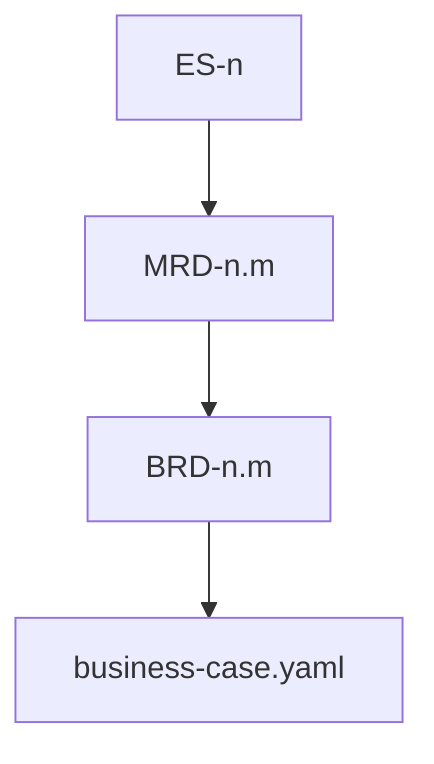

# cascade

**Owner:** Top-down discovery level order (executive-summary → MRD → BRD), inheritance/narrowing, freeze/remap, and per-level gates. Handoff mint is SKILL step 5.

## Pre-cascade: project posture

Before executive-summary, run [project-posture.md](project-posture.md). Done: that ref's Persist condition.

## Ideation gate

If the problem space has no concrete idea yet → run [ideation.md](ideation.md) before L1 compose. Else skip. Persist conditional artifacts when produced.

## Level order

Fixed sequence — never skip a level in `standard`/`deep` depth (`shallow` trims per [input-resolution.md](input-resolution.md)):

```
1. executive-summary  — posture, vision, problem, why, North Star
2. mrd                — market context
3. brd                — business requirements → freeze + business-case
```

PRD is **Plan** (`rr-planner`) — not this cascade. Item identity: `refs/planning/doc-standards/item-schema.md`. Mechanism overflow → `tech.md` (`refs/planning/output-formats.md`).



## Inheritance model

| Level | Inherits from | Narrows to |
|-------|---------------|------------|
| executive-summary | user input, conversation, confirmed `project_posture` | strategic vision, problem framing, posture, metrics, defensibility |
| mrd | executive-summary | market segments, competition, dual-method sizing, Kano needs |
| brd | executive-summary + mrd | business objectives, Power×Interest stakeholders, capabilities/deps |

### Inheritance rules

1. **No contradiction** — child facts align with parent facts. Conflict → [goal-anchor.md](goal-anchor.md).
2. **No orphan items** — `refs/planning/doc-standards/item-schema.md`; verified by `validate_planning.sh`.
3. **Explicit narrowing** — record narrowing as a decision in `session-state.json`.
4. **Unknown vs off-level** — [note-sessions.md](note-sessions.md). Feature/RICE detail → Plan notes, not Discover Musts.

## Per-level cycle

Orchestration owns the skill (SKILL Procedure step 3). For each level in `cascade_levels`, apply only level-variant work:

| Phase | Variant (this level) |
|-------|----------------------|
| Load | `doc-standards/<level>.md` + item-schema |
| Entry | Sweep; [note-sessions.md](note-sessions.md) sidecar; [goal-anchor.md](goal-anchor.md) for the pass |
| Discover | Inherited facts; **ES only** premise ([expert-panel.md](expert-panel.md)); gaps → notes/`raw-history`; reflect → [proactivity.md](proactivity.md); [strategy-lenses.md](strategy-lenses.md) / [gtm-framing.md](gtm-framing.md) on demand |
| Compose | Compose (`refs/planning/contracts.md`) → [compose-prose.md](compose-prose.md); Gate 3 static |
| Exit | Gate 6 → Gate 7 → freeze. After **BRD** pass → SKILL `freeze-handoff` (step 5) |

Stop / resume: SKILL step 3 Stop bullet.

## Per-level completion gates

| Gate | Owner | Done when |
|------|-------|-----------|
| 1 Section coverage | this file | Every required section has a resolved fact or explicit assumption `blocking: false` |
| 2 Goal anchor | [goal-anchor.md](goal-anchor.md) | Disambiguation protocol complete; no blocking unclear/ambiguous input ([goal-anchor.md](goal-anchor.md) §§ Unclear vs ambiguous, Disambiguation protocol) |
| 3 Inheritance integrity | `refs/planning/success-criteria.md` | Static script + judgment list |
| 4 Compose acceptance | [compose-prose.md](compose-prose.md) | Compose ok/accepted partial **and** humanize claim check passed |
| 5 Proactivity | [proactivity.md](proactivity.md) | `standard`/`deep` discovery-time stop |
| 6 Stage-exit | [blind-spots.md](blind-spots.md) | ES/MRD/BRD row only (`in_scope` + `inherit_check`) |
| 7 Viability | [expert-panel.md](expert-panel.md) | Binding at ES/MRD; advisory at BRD |

## Freeze and remap

| Event | Rule |
|-------|------|
| First compose of a level | Dense sibling IDs. Frontmatter `doc_rev: "?"`. |
| Cascade gates pass | Add level to `frozen_levels`. Mint `status.yaml` per `refs/planning/baselines.md`. Freeze does **not** wait on challenge-clean. |
| BRD gates pass (`proceed` / `proceed-with-conditions`) | SKILL step 5 (`freeze-handoff`) — [business-case-handoff.md](business-case-handoff.md). |
| Gate 7 `hold` / `pivot` / `kill` | Do **not** mint `discovery_complete`. Follow [business-case-handoff.md](business-case-handoff.md) / expert-panel ladder. |
| Later insert on frozen level | Append next integer. |
| Explicit re-compose of frozen level | Allowed; humanize via rewrite path; remap children. |
| `--resume` | Continue from `item_registry` / checkpoint. |
| `--change` | Section + target; skill classifies patch vs redirect. |

## Advancing vs stopping

| Condition | Action |
|-----------|--------|
| All gates pass; queue empty | Freeze; mint docs patch; advance (or SKILL `freeze-handoff` after BRD) |
| Pending clarifications / gate gaps | Surface question → re-discover / re-compose |
| Gate 7 `hold` / `pivot` / `kill` | Verdict ladder — no discovery_complete |
| Open re-decision queue | Drain before freeze |
| User pause | SKILL step 3 Stop — checkpoint; skip pre-save |

## Session state

Persist schema: `refs/planning/output-formats.md`. Skill updates `level_facts`, `item_registry`, `frozen_levels`, `project_posture`, `viability[]`, `note_sessions`, `discovery_complete`, `composed_docs`. Compose writes draft cascade docs + `items.json`; skill finalizes prose via [compose-prose.md](compose-prose.md). Skill writes ledger, status, and `business-case.yaml`.
