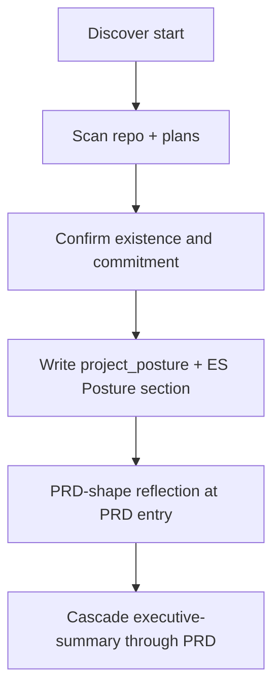

# project-posture

**Owner:** Pre-cascade classification of product existence and commitment, MoSCoW legend (BRD only), PRD-shape reflection defaults, and `domain_context` for the panel.

**Load when:** Discover start, before executive-summary. Resume skips confirm if `session_state.project_posture` is already `user_confirmed: true` and the user has not contradicted it.

MoSCoW applies to **BRD only** in this skill (ES functional deliverables use Must-only; PRD uses RICE/RIC). Do not add `horizon:` on items. Do not skip MRD/BRD for `signed_v1` — change the questions, not the cascade.

## Axes

Two independent axes. Do not collapse into a 3-way enum.

| Axis | Values | Meaning |
|------|--------|---------|
| `existence` | `greenfield` \| `existing` | Is there a product in production (or equivalent shipped behavior)? |
| `commitment` | `unsigned` \| `signed_v1` | Is this session's scope still negotiable, or already locked? |

`source`: `inferred` (scan) until confirm, then `user_confirmed`. Implied fact is not fact — [goal-anchor.md](goal-anchor.md).

## Technique defaults (Discover)

`existence` drives assumption / canvas / pretotype defaults ([ideation.md](ideation.md), [strategy-lenses.md](strategy-lenses.md)):

| `existence` | Assumptions | Strategy lens | Pretotype |
|-------------|-------------|---------------|-----------|
| `greenfield` | 8-cat (VUVF + Ethics + GTM + Strategy & Objectives + Team) | Startup Canvas preferred | Emphasize skin-in-game / YODA |
| `existing` | VUVF-4 only | Gap fill on settled shape | Not mandatory; capability experiments → Plan notes |

## 2×2 and MoSCoW legend (BRD only)



| | `unsigned` (scope negotiable) | `signed_v1` (scope locked) |
|--|--|--|
| **greenfield** | BRD Must = committed business objectives for this session. Should/Could = negotiable. Won't = never. | BRD Must = signed objectives — do not re-cut. Should/Could = post-v1. New Must requires explicit scope-change decision. |
| **existing** | Same BRD cut rules, but shipped behavior is **ES constraint / non-goal**, not a PRD feature to build. | BRD Must = signed remainder. Discovery is gaps + v1+. Do not re-litigate shipped or signed Must. |

Won't = never. Deferred work → `later.md` or ES Horizons. Do not use Won't for "later."

Compose and challenge read `session_state.project_posture`.

## Detection protocol

Lightweight scan, then **confirm**. Ask-only misses brownfield; silent scan treats inference as fact.

### 1. Scan (max 1–2 cheap checks, not research)

Record a candidate with `source: inferred`. Do not write `user_confirmed: true`.

| Signal | Lean |
|--------|------|
| Git history / substantial `src` / app manifests (`package.json`, `pom.xml`, `*.csproj`, etc.) | `existing` |
| Empty or scaffold-only tree | `greenfield` |
| Existing `docs/plan/` with frozen PRD or a named contract | `signed_v1` candidate |

Stop after two checks. Do not inventory the codebase.

### 2. Confirm

Surface via `question_mode` (`AskQuestion` / text). Options:

- Greenfield unsigned
- Greenfield signed v1
- Existing unsigned
- Existing signed v1
- Other (capture nuance)

NL tokens `greenfield`, `brownfield`, `existing`, `signed v1` in the prompt **seed** this confirm. They are not a primary action flag — [input-resolution.md](input-resolution.md).

In the same confirm turn (or immediately after), capture `domain_context` — required for the panel ([expert-panel.md](expert-panel.md)):

| Field | Ask | Values |
|-------|-----|--------|
| `industry` | What industry does this problem live in? | Free text (e.g. mid-market 3PL) |
| `buyer_archetype` | Who pays / who is accountable? | Free text (e.g. CFO; platform eng manager) |
| `regulatory_regime` | Binding regime? | Named regime or `none` |
| `market_type` | External product or internal platform? | `external` \| `internal` |

Do not invent an industry to fill the shape. Missing `market_type` is blocking — internal work has no TAM and the MRD sizing gate is a different procedure.

### 3. Follow-ups (one each, only if applicable)

| Posture | Ask | Record as |
|---------|-----|-----------|
| `existing` | What is already shipped vs what this session is for? | ES constraints / non-goals — **not** PRD features |
| `signed_v1` | What is in the signed set? (pointer to contract, prior PRD, or user list) | Those IDs become BRD Must; do not offer them for demotion |

### 4. Persist

1. `session_state.project_posture` (schema below), including `domain_context`.
2. Exec-summary **Posture** section — docs are source of truth for challenge. Do not mint an `ES-*` id for it.
3. Decision log: `type: project_posture`, `user_confirmed: true`.

### 5. Resume

`--resume`: do not re-ask unless the user contradicts the stored posture. Contradiction → re-confirm, rewrite the Posture section, log a new `project_posture` decision.

## Session field

```json
{
  "existence": "greenfield",
  "commitment": "unsigned",
  "source": "user_confirmed",
  "user_confirmed": true,
  "signed_set": [],
  "shipped_summary": null,
  "prd_shape": "feature_led",
  "scope_mode": "closed",
  "domain_context": {
    "industry": "mid-market 3PL",
    "buyer_archetype": "CFO",
    "regulatory_regime": "none",
    "market_type": "internal"
  }
}
```

| Field | Notes |
|-------|-------|
| `existence` / `commitment` | Required after confirm |
| `source` | `inferred` until confirm, then `user_confirmed` |
| `signed_set` | Item ids or contract pointers when `signed_v1`; else `[]` |
| `shipped_summary` | One-line shipped-vs-session when `existing`; else `null` |
| `prd_shape` | `story_led` \| `feature_led` \| `hybrid` — set at PRD-shape reflection (T8-25) |
| `scope_mode` | `discovery` \| `closed` — set at PRD-shape reflection (T8-26) |
| `domain_context` | Required after confirm. Instantiates the domain-practitioner seat and selects the internal vs external ES premise test and MRD sizing gate ([expert-panel.md](expert-panel.md)). |

## Cascade impact

| Do | Do not |
|----|--------|
| Run the full level list (depth still trims) | Skip MRD/BRD because v1 is signed |
| Ask market/business questions as *constraints on the increment* when `existing` / `signed_v1` | Re-open a locked BRD Must set |
| Run PRD-shape reflection before minting PRD structure | Apply MoSCoW cut-pass on PRD (superseded by RICE) |
| Cite BRD MoSCoW legend when cutting business scope | Store a second rank on items |

Off-level answers (feature volunteered during vision, etc.): [note-sessions.md](note-sessions.md) — not an ES assumption.

## Failure modes this blocks

- Planning an existing signed v1 as a greenfield MVP (Must inflation, re-litigating committed scope)
- Dumping future work into BRD Must because "important"
- Using Won't for "later"
- Restating production behavior as PRD features to build
- Running a PRD cut-pass instead of RICE scoring
