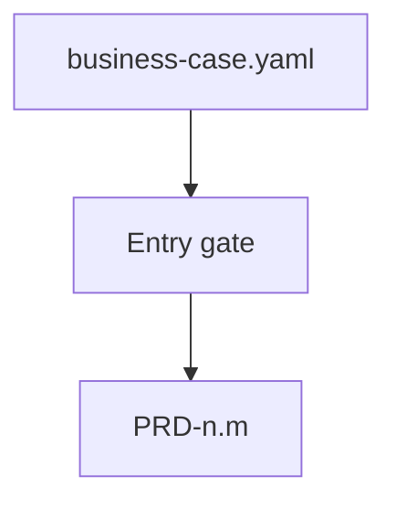

# cascade

**Owner:** Plan-level PRD order, inheritance from frozen Discover parents, freeze/remap, and PRD completion gates. Discover cascade (executive-summary → MRD → BRD + business-case) is owned by `rr-discovery`.

## Entry gate (before PRD)

Refuse PRD compose/change unless:

1. `brd` ∈ `session_state.frozen_levels`, **and**
2. Valid `business-case.yaml` present ([business-case-handoff.md](../../rr-discovery/refs/business-case-handoff.md))

Skill enforces via [input-resolution.md](input-resolution.md). Brownfield migration = one AskQuestion, not silent.

## Pre-PRD: posture reflection

Before minting PRD structure, run [project-posture.md](project-posture.md) **PRD-shape reflection** (existence/commitment already confirmed in Discover). Do not re-run Discover posture/ideation.

## Level order (Plan)

```
prd — product requirements from frozen business case
```

Parents are frozen Discover docs (`executive-summary`, `mrd`, `brd`) — do not recompose them in Plan. Item identity: [doc-standards/item-schema.md](../../../refs/planning/doc-standards/item-schema.md). Mechanism overflow → `tech.md` ([output-formats.md](../../../refs/planning/output-formats.md)).



## Inheritance model

| Level | Inherits from | Narrows to |
|-------|---------------|------------|
| prd | Frozen ES + MRD + BRD + `business-case.yaml` | Product capabilities, user outcomes, RICE/RIC priorities |

### Inheritance rules

1. **No contradiction** — PRD facts align with frozen parents and handoff fields. Conflict → [goal-anchor.md](goal-anchor.md).
2. **No orphan items** — [doc-standards/item-schema.md](../../../refs/planning/doc-standards/item-schema.md); verified by `validate_planning.sh`.
3. **Explicit narrowing** — record narrowing as a decision in `session-state.json`.
4. **Unknown vs off-level** — [note-sessions.md](note-sessions.md). Market/viability reopen → park and route to `rr-discovery`, not silent PRD Musts.

## Per-level Plan flow (skill-inline)

For `cascade_levels` containing `prd`:

1. Load [doc-standards/prd.md](doc-standards/prd.md) and [doc-standards/item-schema.md](../../../refs/planning/doc-standards/item-schema.md).
2. On entry: re-decision sweep ([decision-ledger.md](../../../refs/planning/decision-ledger.md) trigger 2); sidecar load ([note-sessions.md](note-sessions.md)).
3. Present handoff summary from `business-case.yaml` (brief). Run PRD-shape reflection once before Gate 6 ([project-posture.md](project-posture.md)).
4. Ask for gaps in required sections. Mint ledger rationale when a ranked-leaf decision is made.
5. After every Q&A: [note-sessions.md](note-sessions.md) + append `raw-history/{UTC}.yaml`. On reflect trigger → [proactivity.md](proactivity.md) (Gate 5; `standard`/`deep` only).
6. Accumulate `level_facts`. Compose consumes notes for `doc_type: prd` only.
7. Invoke compose ([contracts.md](../../../refs/planning/contracts.md)) with **allowlist `prd` only**. Confirm overwrite **before first compose** if files exist; intra-session re-compose overwrites without asking. After draft receipt: **mandatory** [compose-prose.md](../../rr-discovery/refs/compose-prose.md) before treating persist complete. If that doc’s `challenge.status` is clean/dirty-accepted, skill sets it `dirty` ([baselines.md](../../../refs/planning/baselines.md)).
8. Clarification loop ([contracts.md](../../../refs/planning/contracts.md)).
9. Refresh `item_registry` from `items.json`. Gate 3 static ([success-criteria.md](../../../refs/planning/success-criteria.md)).
10. Gate 6 then Gate 7 (table below). On Gate pass: **freeze** PRD — `frozen_levels` + docs-patch mint in `status.yaml` ([baselines.md](../../../refs/planning/baselines.md)).

## Stop and resume

User may stop at any point:

1. Leave composed files on disk (drafts until freeze). Do not rewrite Discover cascade docs.
2. Checkpoint full `session-state.json` ([output-formats.md](../../../refs/planning/output-formats.md)).
3. Set `checkpoint.status: paused` with `current_level: prd`.

Resume: `rr-planner --resume --output-dir <same-dir>`. Load checkpoint; sweep; continue at PRD.

## Per-level completion gates

| Gate | Owner | Done when |
|------|-------|-----------|
| 1 Section coverage | this file | Every required PRD section has a resolved fact or explicit assumption `blocking: false` |
| 2 Goal anchor | [goal-anchor.md](goal-anchor.md) | That ref's level-complete conditions; Q&A in raw-history |
| 3 Inheritance integrity | [success-criteria.md](../../../refs/planning/success-criteria.md) | Static: `validate_planning.sh`. Judgment: compose/challenge list |
| 4 Compose acceptance | [contracts.md](../../../refs/planning/contracts.md) + prd standard | Compose `status: ok` or user-accepted `partial`; humanize done; `item_registry` refreshed |
| 5 Proactivity | [proactivity.md](proactivity.md) | `standard`/`deep` only: that ref's stop. Pre-save is not this gate |
| 6 Stage-exit | [blind-spots.md](blind-spots.md) | **PRD row only**. Premise-critical findings escalate into Gate 7 |
| 7 Viability | [expert-panel.md](expert-panel.md) | That ref's Gate 7 persist (advisory weight vs Discover binding — still required) |

## Freeze and remap

| Event | Rule |
|-------|------|
| First compose of PRD | Mint dense sibling IDs. Frontmatter `doc_rev: "?"`. |
| Cascade gates pass for PRD | Add `prd` to `frozen_levels`. Skill mints `status.yaml` rev/digest/docs patch. |
| Later insert on frozen PRD | Append next integer. Do not renumber. |
| Explicit re-compose of frozen PRD | Allowed with remap rules; obligation-preserving → lock-target. |
| `--resume` | Continue minting from max sibling index on frozen PRD. |
| `--change` | Section + target on PRD. Skill classifies patch vs redirect vs open-next vs unfreeze. |

Unlock / patch-only-current are **skill stops** in [baselines.md](../../../refs/planning/baselines.md), not validator FAILs.

## Advancing vs stopping

| Condition | Action |
|-----------|--------|
| All gates pass; no leftover `partial` notes; re-decision queue empty | Freeze PRD; mint docs patch; dirty challenge attestation if digest moved |
| Pending clarifications or gate gaps | Surface question → re-compose |
| Gate 7 `hold` / `pivot` / `kill` | [expert-panel.md](expert-panel.md) verdict ladder |
| Open re-decision queue | Drain before freeze |
| User requests stop / pause | Checkpoint; skip pre-save; exit cleanly |
| Market/viability reopen | Do **not** unfreeze Discover silently — route to `rr-discovery` |

## Session state

Persist: [output-formats.md](../../../refs/planning/output-formats.md). Skill updates `level_facts` (prd), `item_registry`, `frozen_levels`, `composed_docs`, ledger, `status.yaml`. Compose writes `prd.md` draft + `items.json`; skill humanizes then freezes. Compose does not write `status.yaml` or `business-case.yaml`.
