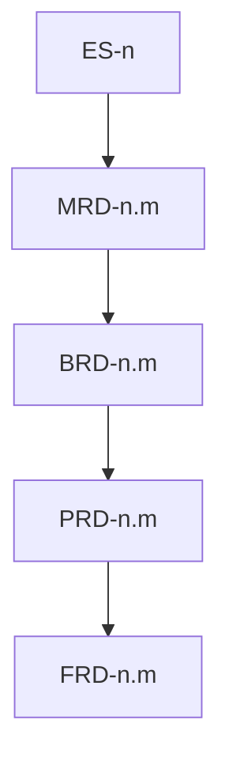

# cascade

**Owner:** Top-down level order, inheritance/narrowing rules, freeze/remap, and per-level completion gates.

## Pre-cascade: project posture

Before exec-summary, run [project-posture.md](project-posture.md). Done: that ref's persist condition.

## Level order

Fixed sequence — never skip a level in `standard`/`deep` depth (`shallow` trims per [input-resolution.md](input-resolution.md)):

```
1. exec-summary  — posture, vision, problem, why
2. mrd           — market context
3. brd           — business requirements
4. prd           — product requirements
5. frd           — functional detail
```

Item identity, parent walk, spec/build: [doc-standards/item-schema.md](doc-standards/item-schema.md). Freeze/remap: this file.



## Inheritance model

Each level **inherits** all resolved facts from levels above and **narrows** scope:

| Level | Inherits from | Narrows to |
|-------|---------------|------------|
| exec-summary | user input, conversation, confirmed `project_posture` | strategic vision, problem framing, and posture |
| mrd | exec-summary | market segments, competitors, trends relevant to vision |
| brd | exec-summary + mrd | business objectives, stakeholders, constraints |
| prd | exec-summary + mrd + brd | product capabilities, user outcomes, priorities |
| frd | all above | functional behaviors, acceptance criteria, interfaces |

### Inheritance rules

1. **No contradiction** — child facts must align with parent facts. Conflict → [goal-anchor.md](goal-anchor.md) + question (per `question_mode`).
2. **No orphan items** — parent walk and cross-doc previous-level-only: [doc-standards/item-schema.md](doc-standards/item-schema.md). Verified by `validate_planning.py` (Gate 3 + [success-criteria.md](success-criteria.md) static).
3. **Explicit narrowing** — when a parent fact is too broad for the child level, record the narrowing as a decision in `session-state.json`.
4. **Unknown vs off-level** — details not yet known *at this level* are `assumptions[]` or `open_questions[]`, not silently invented. Off-level content: [note-sessions.md](note-sessions.md).
5. **Priority inheritance** — FRD may default `if_absent` magnitude from parent PRD MoSCoW (Must → high, Should → moderate, Could → low). Won’t PRD items get no FRD children. Do not copy MoSCoW onto FRD. Magnitudes are unchanged; only the human MoSCoW *legend* follows [project-posture.md](project-posture.md).

## Per-level discovery flow (skill-inline)

For each level in `cascade_levels`:

1. Load `doc-standards/<level>.md` and [doc-standards/item-schema.md](doc-standards/item-schema.md). Extract required sections; claims are items (prose overviews stay unnumbered).
2. On level entry: re-decision sweep ([decision-ledger.md](decision-ledger.md) trigger 2); then sidecar load ([note-sessions.md](note-sessions.md)). Do not start new questions until parked notes are addressed or kept as still-unclear.
3. Load [goal-anchor.md](goal-anchor.md) for the entire discovery pass.
4. Present inherited facts (brief). **Exec-summary only:** premise test ([expert-panel.md](expert-panel.md)) after posture + `domain_context`.
5. Ask for gaps in required sections. New items: [doc-standards/item-schema.md](doc-standards/item-schema.md) spec defaults. Mint the ledger rationale when a ranked-leaf decision is made ([decision-ledger.md](decision-ledger.md)).
6. After every Q&A: [note-sessions.md](note-sessions.md) + append `raw-history/{UTC}.yaml`. After every evidence round: [expert-panel.md](expert-panel.md) evidence loop + sweep (trigger 1). On reflect trigger → [proactivity.md](proactivity.md) (Gate 5; `standard`/`deep` only). PRD after MoSCoW: [project-posture.md](project-posture.md) cut-pass once before Gate 6.
7. Accumulate `level_facts` (include `Rationale` ids for ranked leaves). Compose consumes notes for this `doc_type` only.
8. Invoke compose ([contracts.md](contracts.md)). Confirm overwrite **before first compose** if files exist from a prior run; intra-session re-compose overwrites without asking. After persist: prune ([note-sessions.md](note-sessions.md)).
9. Clarification loop ([contracts.md](contracts.md)). Append raw-history on each answer before re-invoke.
10. Refresh `item_registry` from `items.json`. Gate 3 static ([success-criteria.md](success-criteria.md)).
11. Gate 6 then Gate 7 (table below). On Gate pass: **freeze** this level (Freeze and remap) — `frozen_levels` in session-state, not a second write of the doc.

## Stop and resume

User may stop at any point ("stop", "pause", "done for now", etc.):

1. Leave composed files on disk, including the current unfrozen level (drafts until freeze). Do not rewrite cascade docs. Do not run pre-save reflection.
2. Checkpoint full `session-state.json` to `--output-dir` ([output-formats.md](output-formats.md)). Do not prune sidecars on pause ([note-sessions.md](note-sessions.md) owns prune).
3. Set `checkpoint.status: paused` with `current_level` and `pending_clarifications`.

To resume: `rr-planner --resume --output-dir <same-dir>` (or NL "continue planning"). Load checkpoint; sweep (trigger 3); append Q&A to `raw_history_path`; pick up at `current_level`. Remap uses `item_registry`. Ledger summary: [decision-ledger.md](decision-ledger.md). Output-dir defaults and old-dir fallback: [input-resolution.md](input-resolution.md).

## Per-level completion gates

A level is **complete** only when all gates pass. Freeze/advance: Advancing vs stopping.

| Gate | Owner | Done when |
|------|-------|-----------|
| 1 Section coverage | this file | Every required section in the matching doc-standard has a resolved fact or explicit assumption `blocking: false` |
| 2 Goal anchor | [goal-anchor.md](goal-anchor.md) | That ref's level-complete conditions; Q&A for this level is in raw-history YAML |
| 3 Inheritance integrity | [success-criteria.md](success-criteria.md) | Static: `validate_planning.py`. Judgment: that ref's compose/challenge list |
| 4 Compose acceptance | [contracts.md](contracts.md) + doc-standard | Compose `status: ok` or user-accepted `partial`; written doc passes done-when; `item_registry` refreshed from `items.json` |
| 5 Proactivity | [proactivity.md](proactivity.md) | `standard`/`deep` only: that ref's discovery-time stop. Pre-save is not this gate |
| 6 Stage-exit | [blind-spots.md](blind-spots.md) | That ref's skill-inline stage-exit rules. Premise-critical findings escalate into Gate 7 |
| 7 Viability | [expert-panel.md](expert-panel.md) | That ref's Gate 7 persist |

## Freeze and remap

| Event | Rule |
|-------|------|
| First compose of a level | Mint dense sibling IDs (`1, 2, 3` / `n.1, n.2`). |
| Cascade gates pass for that level | Add level to `frozen_levels`. IDs freeze. |
| Later insert on a frozen level | Append next integer. Do not renumber existing ids. |
| Explicit re-compose of a frozen level | Allowed. Compose rewrites child-doc `parent:` and `items.json` in the same invocation so e.g. FRD does not point at a vanished `PRD-3`. Skill refreshes `item_registry` from `items.json`. |
| `--resume` | Load `item_registry`; continue minting from max sibling index on frozen levels. |

## Advancing vs stopping

| Condition | Action |
|-----------|--------|
| All gates pass (including Gate 6 and Gate 7 `proceed` / `proceed-with-conditions`); no leftover `partial` notes; re-decision queue empty | Freeze level; advance to next cascade level |
| Pending clarifications or gate gaps | Surface question → re-discover or re-compose (no round cap) |
| Gate 7 verdict is `hold` / `pivot` / `kill` | [expert-panel.md](expert-panel.md) verdict ladder (freeze/advance column) |
| Open re-decision queue | Drain (keep / postpone / kill / revive) before freeze |
| User says done for level | Accept current state **unless** binding `hold`/`kill` or open queue; else advance or checkpoint per user intent |
| User requests stop / pause | Checkpoint `session-state.json`; leave files already on disk; skip pre-save; exit cleanly |
| `--resume` | Load checkpoint; sweep; append raw-history; continue from `current_level` |

## Session state

Persist and schema: [output-formats.md](output-formats.md) `session-state.json`. Skill updates `level_facts`, `item_registry` (from `items.json` after compose), `frozen_levels`, `project_posture` (including `domain_context`), `viability[]`, `note_sessions`, and `composed_docs` paths across levels. Skill writes `decision-ledger.yaml`. Checkpoint on stop and after each level freeze (`raw_history_path` required once Q&A has started). Compose writes cascade docs and `items.json`.
