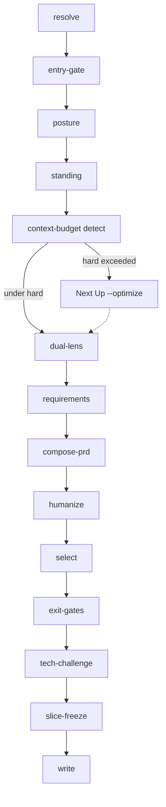

# cascade

**Owner:** Plan level order, inheritance/narrowing, freeze/remap, per-level cycle variants and gates. Orchestration is SKILL Procedure step 4. Discover cascade (ES→MRD→BRD + business-case) is owned by `rr-discovery`.

## Happy path (Plan)

Canonical order for `--prd` / first Plan. Todo ids match SKILL Procedure. Auto-reflection ([goal-anchor.md](goal-anchor.md)) runs at every phase transition — not its own step.

**Hard rule:** `compose`/`humanize` after requirements facts are ready, **before** select / exit-gates / tech-challenge / slice-freeze. Never after freeze.

**Hard rule:** Interview and score/architect are one `dual-lens` sitting — neither completes without the other.



| Phase | Todo id | What happens | Stop / gate |
|-------|---------|--------------|-------------|
| 1 | `resolve` | Status-first + payload | Discover flags → route out |
| 2 | `entry-gate` | Frozen BRD + `business-case.yaml` | Fail → AskQuestion; no silent compose |
| 3 | `posture` | PRD-shape + `arch_doc_mode` + Coach/Fast once | Confirm before mint |
| 4 | `standing` | Constitution INDEX (± tech ADRs); skill-owned mint + humanize; then [context-budget.md](context-budget.md) detect | Draft rev OK; hard → block full-load; Next Up `--optimize` |
| 5 | `dual-lens` | Interview **and** system-design **same sitting** (scoped: constitution + feature delta + cited ADR); RICE + Effort drivers / UX-shape | Refuse Effort-without-architecture ([system-design.md](system-design.md)); `CONTEXT_BUDGET_EXCEEDED` blocks corpus dump |
| 6 | `requirements` | Full P1–P3 retained in facts | Do not shrink table |
| 7 | `compose` → `humanize` | Compose `Task` (`doc_type: prd`) then `compose-prose` | Gate 4; mandatory humanize |
| 8 | `select` | Thin `_status_:` subset for buildable kernel | Selection ≠ delete rows |
| 9 | `exit-gates` | WWAS + req-smell; Gate 6 stage-exit; Gate 7 if premise-critical | Smell-clean ≠ freeze-ready |
| 10 | `tech-challenge` | Standard challenge (cheaper-first ladder first) | Open queues → drain, do not spawn |
| 11 | `slice-freeze` | Mint `execute-slice.yaml` | Only after challenge clear / risk-accept + goal-likelihood stop |
| 12 | `write` | session-state + `status.yaml` + Next Up | Always |

### Side paths (not the happy path)

| Action | Sequence |
|--------|----------|
| `setup` | `resolve` → `setup` → stop |
| `research` / `challenge` alone | `resolve` → context-budget detect → research/challenge (scoped load) → `write` |
| `optimize` | `resolve` → audit + suggest alternatives → AskQuestion → apply ≤2 loops → `write` ([context-budget.md](context-budget.md)) |
| `freeze-slice` (selection already done) | `resolve` → `entry-gate` → `exit-gates` (smell) → `tech-challenge?` → `slice-freeze` → `write` |
| `change` | Same spine, section-scoped; re-enter at affected phase, not full replay from posture unless redirect. **Stop-rule:** any constitution / PRD / delta prose persist → mandatory `compose-prose` humanize + dirty challenge attestation **before** any challenge `Task` |

## Entry gate (before Plan)

SoT: [input-resolution.md](input-resolution.md) Entry gate (frozen BRD + `business-case.yaml`; brownfield = one AskQuestion). Do not restate conditions here. Phase id: `entry-gate`.

## Pre-Plan: posture

Before minting PRD / standing structure, run [project-posture.md](project-posture.md) **PRD-shape + `arch_doc_mode`** (existence/commitment already confirmed in Discover). Offer Coach/Fast once ([plan-interview.md](plan-interview.md)). Do not re-run Discover posture/ideation. Phase id: `posture`.

## Level order (Plan)

Same spine as Happy path (Plan) above — do not invent a shorter order:

```
resolve → entry-gate → posture → standing → dual-lens → requirements → compose → humanize → select → exit-gates → tech-challenge → slice-freeze → write
```

Parents are frozen Discover docs — do not recompose them in Plan. Item identity: `refs/planning/doc-standards/item-schema.md`. Standing docs: [constitution.md](doc-standards/constitution.md), [architecture.md](doc-standards/architecture.md), [feature-delta.md](doc-standards/feature-delta.md).

## Inheritance model

| Artifact | Inherits from | Narrows to |
|----------|---------------|------------|
| prd | Frozen ES + MRD + BRD + handoff | Capabilities, full requirements, WWAS AC, selection |
| architecture / deltas | Discover constraints + PRD capabilities | Tech ADRs + feature mechanism |
| constitution | Discover constraints + product non-negotiables | Always-load INDEX |

### Inheritance rules

1. **No contradiction** — Plan facts align with frozen parents and handoff. Conflict → [goal-anchor.md](goal-anchor.md).
2. **No orphan items** — item-schema; verified by `validate_planning.sh`.
3. **Explicit narrowing** — record as a decision in `session-state.json`.
4. **Unknown vs off-level** — [note-sessions.md](note-sessions.md). Market/viability reopen → park and route to `rr-discovery`.
5. **Selection ≠ shrink** — `_status_:` only; never delete deferred requirements to “match the slice.”
6. **Backward-chain challenge** — If current parents cannot support builder→Discover-objective (wrong Musts, Cost vs WWAS drift, obligation lies), Plan must challenge Discover: emit ranked Plan→Discover reopen candidates and route `ask-discover` — do not silent-unfreeze or bury as Plan-only HOLD ([goal-anchor.md](goal-anchor.md)).

## Per-level cycle

Orchestration owns the skill (SKILL Procedure step 4). For `prd` / `change` / `freeze-slice`, apply only Plan-variant work. Phase ids match Happy path (Plan):

| Phase id | Variant (Plan) |
|----------|----------------|
| Load | [prd.md](doc-standards/prd.md) + item-schema + [plan-interview.md](plan-interview.md) |
| `entry-gate` + `posture` | Re-decision sweep (`refs/planning/decision-ledger.md`); [note-sessions.md](note-sessions.md) sidecar; handoff summary; then Pre-Plan posture above |
| `standing` | Constitution (+ tech ADRs on demand); skill-owned mint + humanize; **context-budget detect** ([constitution.md](doc-standards/constitution.md), [architecture.md](doc-standards/architecture.md), [feature-delta.md](doc-standards/feature-delta.md), [decision-lite.md](decision-lite.md), [context-budget.md](context-budget.md)) |
| `dual-lens` | Interview **and** system-design **same sitting** — scoped load; [plan-interview.md](plan-interview.md) → [prioritization-lens.md](prioritization-lens.md); Effort gated by [system-design.md](system-design.md); feature deltas when scoring; mint ledger rationale on ranked leaves; after Q&A → notes + raw-history; reflect → [proactivity.md](proactivity.md). Neither interview nor score completes without the other. |
| `requirements` | Full P1–P3 set retained in facts — never shrink the table |
| `compose` → `humanize` | Compose `Task` (`doc_type: prd` only) → **mandatory** `skills/rr-discovery/refs/compose-prose.md`; clarification loop (`refs/planning/contracts.md`); dirty challenge attestation when clean (`refs/planning/baselines.md`). **Before** select / exit / challenge / freeze. |
| `select` | Thin `_status_:` subset for buildable kernel — prefer shorter Plan cycles over doc-only breadth; defer with status — do not delete rows or invent a “docs-complete” slice ([execute-handoff.md](execute-handoff.md)) |
| `exit-gates` | WWAS + [req-smell.md](req-smell.md); Gate 6 stage-exit; Gate 7 if premise-critical. Smell-clean ≠ freeze-ready. |
| `tech-challenge` | Standard challenge (inject Plan [challenge-method.md](challenge-method.md); compact `parent_summary`); cheaper-first ladder first; open queues → drain, do not spawn |
| `slice-freeze` | [execute-handoff.md](execute-handoff.md) mint; whole-PRD freeze = optional structure lock only |

Stop / resume: leave drafts on disk; checkpoint `session-state.json` with `checkpoint.status: paused`. Resume: `rr-planner --resume --output-dir <same-dir>`. Do not rewrite Discover docs.

## Per-level completion gates

| Gate | Owner | Done when |
|------|-------|-----------|
| 1 Section coverage | this file | Required PRD sections resolved or assumed `blocking: false` |
| 2 Goal anchor | [goal-anchor.md](goal-anchor.md) | That ref's conditions **including Standing self-challenge (auto-reflection)** at phase transitions |
| 3 Inheritance integrity | `refs/planning/success-criteria.md` | Static + judgment |
| 4 Compose acceptance | contracts + prd standard | Compose ok/accepted partial; humanize done |
| 5 Proactivity | [proactivity.md](proactivity.md) | Dual-lens; Effort gated per [system-design.md](system-design.md) |
| 6 Stage-exit | [blind-spots.md](blind-spots.md) | Technical-plan row; premise-critical → Gate 7 |
| 7 Viability | [expert-panel.md](expert-panel.md) | Advisory weight vs Discover binding — still required |
| Slice | [execute-handoff.md](execute-handoff.md) + req-smell + challenge-layers | Kernel mint; selection intact; freeze-suggest = standard-clear or risk-accept |

## Freeze and remap

| Event | Rule |
|-------|------|
| First compose of PRD | Mint dense sibling IDs. Frontmatter `doc_rev: "?"`. |
| Slice freeze | Primary handoff — `execute-slice.yaml` + `slice:` stamp; constitution/architecture may be `draft`. |
| Whole-PRD structure lock | Optional — add `prd` to `frozen_levels` + docs-patch mint. |
| Later insert on frozen PRD | Append next integer. Do not renumber. |
| Explicit re-compose | Allowed with remap; obligation-preserving → lock-target. |
| `--change` | Section + target. Skill classifies patch vs redirect vs open-next vs unfreeze. |

Unlock / patch-only-current: `refs/planning/baselines.md`.

## Advancing vs stopping

| Condition | Action |
|-----------|--------|
| Smell-clean (or holds); constitution present; selection intact; **and** auto-reflection clear; **and** no open standing red flag / Discover-reopen (or founder accept); **and** nature Done-when met or per-axis HOLD; **and** standard challenge clear **or** risk-accept ([execute-handoff.md](execute-handoff.md), `refs/planning/challenge-layers.md`) | Skill may **auto-suggest** slice freeze; mint kernel on confirm |
| Standing red flag / Discover-reopen open | Do **not** offer freeze as Next-Up; route `ask-discover` or record founder accept ([note-sessions.md](note-sessions.md)) |
| Smell-clean alone | **Anti-trigger:** not freeze-ready — run auto-reflection + standard challenge (or risk-accept) first |
| Open quality debt, user says freeze | **Quality veto** — refuse unless risk-accept AskQuestion → `dirty-accepted` |
| Draft Discover / solid subset | Work advance allowed when cited subset load-bearing-stable; freeze mint still needs frozen parents |
| Pending clarifications or gate gaps | Surface question → re-compose |
| Gate 7 `hold` / `pivot` / `kill` | expert-panel verdict ladder |
| Sprint/capacity language | Refuse; reframe as slice selection |
| Market/viability reopen | Route to `rr-discovery` — do not silent-unfreeze Discover |

Next Up close habits: `refs/planning/progress.md`. Process-ownership: [`INTENT.md`](../../../INTENT.md) UX.

## Session state

Persist: `refs/planning/output-formats.md`. Skill updates `level_facts`, `item_registry`, `frozen_levels`, `composed_docs`, ledger, `status.yaml` (incl. `slice:`). Compose writes `prd.md` + `items.json`; skill owns standing docs mint paths (constitution-primary) and slice kernel.
