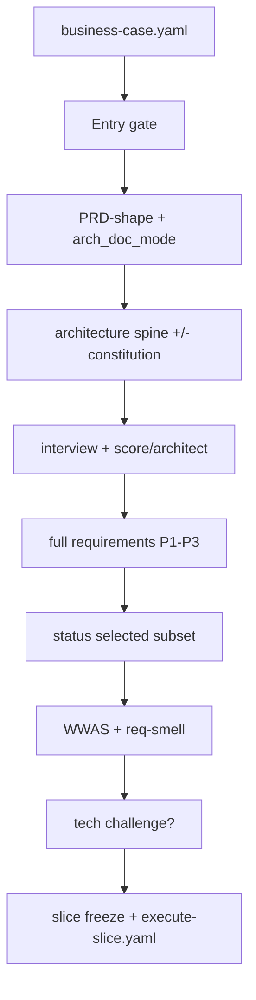

# cascade

**Owner:** Plan flow — posture, standing architecture, interview/score, full requirements, selection, AC smell, optional technical challenge, slice freeze. Discover cascade (ES→MRD→BRD + business-case) is owned by `rr-discovery`.

## Entry gate (before Plan)

Refuse Plan compose/change unless:

1. `brd` ∈ discovery `session_state.frozen_levels` (or discovery `status.yaml` frozen BRD), **and**
2. Valid `business-case.yaml` present (`skills/rr-discovery/refs/business-case-handoff.md`)

Skill enforces via [input-resolution.md](input-resolution.md). Brownfield migration = one AskQuestion, not silent.

## Pre-Plan: posture

Before minting PRD / standing structure, run [project-posture.md](project-posture.md) **PRD-shape + `arch_doc_mode`** (existence/commitment already confirmed in Discover). Offer Coach/Fast once ([plan-interview.md](plan-interview.md)). Do not re-run Discover posture/ideation.

## Level order (Plan)

```
standing architecture (+ constitution) → PRD (full requirements) → select → AC smell → challenge? → slice freeze
```

Parents are frozen Discover docs — do not recompose them in Plan. Item identity: `refs/planning/doc-standards/item-schema.md`. Standing docs: [architecture.md](doc-standards/architecture.md), [feature-delta.md](doc-standards/feature-delta.md).



## Inheritance model

| Artifact | Inherits from | Narrows to |
|----------|---------------|------------|
| prd | Frozen ES + MRD + BRD + handoff | Capabilities, full requirements, WWAS AC, selection |
| architecture / deltas | Discover constraints + PRD capabilities | Invariants + feature mechanism |

### Inheritance rules

1. **No contradiction** — Plan facts align with frozen parents and handoff. Conflict → [goal-anchor.md](goal-anchor.md).
2. **No orphan items** — item-schema; verified by `validate_planning.sh`.
3. **Explicit narrowing** — record as a decision in `session-state.json`.
4. **Unknown vs off-level** — [note-sessions.md](note-sessions.md). Market/viability reopen → park and route to `rr-discovery`.
5. **Selection ≠ shrink** — `_status_:` only; never delete deferred requirements to “match the slice.”

## Per-level Plan flow (skill-inline)

For Plan actions (`prd` / `change` / freeze-slice):

1. Load [prd.md](doc-standards/prd.md), item-schema, [plan-interview.md](plan-interview.md).
2. On entry: re-decision sweep (`refs/planning/decision-ledger.md`); sidecar load ([note-sessions.md](note-sessions.md)).
3. Present handoff summary. Run posture + Coach/Fast once ([project-posture.md](project-posture.md)).
4. **Standing** — author/update spine (+ constitution per mode); feature deltas as capabilities score ([system-design.md](system-design.md), [adr-lite.md](adr-lite.md)).
5. Interview → score+architect same sitting. Mint ledger rationale when ranked-leaf decisions land.
6. After every Q&A: notes + raw-history. Reflect triggers → [proactivity.md](proactivity.md).
7. Compose PRD (`doc_type: prd` only) → **mandatory** `skills/rr-discovery/refs/compose-prose.md`. Dirty challenge attestation when clean (`refs/planning/baselines.md`).
8. Clarification loop (`refs/planning/contracts.md`).
9. Select via `_status_:`; WWAS + [req-smell.md](req-smell.md).
10. Optional technical challenge — inject Plan [challenge-method.md](challenge-method.md); parent keeps compact summary.
11. **Slice freeze** — [execute-handoff.md](execute-handoff.md); stamp `status.yaml` `slice:`. Whole-PRD freeze = optional structure lock only.

## Stop and resume

1. Leave composed files on disk (drafts until slice/structure freeze). Do not rewrite Discover docs.
2. Checkpoint `session-state.json`.
3. Set `checkpoint.status: paused` with `current_level` reflecting Plan phase.

Resume: `rr-planner --resume --output-dir <same-dir>`.

## Per-level completion gates

| Gate | Owner | Done when |
|------|-------|-----------|
| 1 Section coverage | this file | Required PRD sections resolved or assumed `blocking: false` |
| 2 Goal anchor | [goal-anchor.md](goal-anchor.md) | That ref's conditions |
| 3 Inheritance integrity | `refs/planning/success-criteria.md` | Static + judgment |
| 4 Compose acceptance | contracts + prd standard | Compose ok/accepted partial; humanize done |
| 5 Proactivity | [proactivity.md](proactivity.md) | Effort-without-architecture blocked; dual-lens |
| 6 Stage-exit | [blind-spots.md](blind-spots.md) | Technical-plan row; premise-critical → Gate 7 |
| 7 Viability | [expert-panel.md](expert-panel.md) | Advisory weight vs Discover binding — still required |
| Slice | [execute-handoff.md](execute-handoff.md) + req-smell | Kernel mint; selection intact |

## Freeze and remap

| Event | Rule |
|-------|------|
| First compose of PRD | Mint dense sibling IDs. Frontmatter `doc_rev: "?"`. |
| Slice freeze | Primary handoff — `execute-slice.yaml` + `slice:` stamp; architecture may be `draft`. |
| Whole-PRD structure lock | Optional — add `prd` to `frozen_levels` + docs-patch mint. |
| Later insert on frozen PRD | Append next integer. Do not renumber. |
| Explicit re-compose | Allowed with remap; obligation-preserving → lock-target. |
| `--change` | Section + target. Skill classifies patch vs redirect vs open-next vs unfreeze. |

Unlock / patch-only-current: `refs/planning/baselines.md`.

## Advancing vs stopping

| Condition | Action |
|-----------|--------|
| Smell-clean (or holds); architecture present; selection intact | Slice freeze; mint kernel |
| Pending clarifications or gate gaps | Surface question → re-compose |
| Gate 7 `hold` / `pivot` / `kill` | expert-panel verdict ladder |
| Sprint/capacity language | Refuse; reframe as slice selection |
| Market/viability reopen | Route to `rr-discovery` — do not silent-unfreeze Discover |

## Session state

Persist: `refs/planning/output-formats.md`. Skill updates `level_facts`, `item_registry`, `frozen_levels`, `composed_docs`, ledger, `status.yaml` (incl. `slice:`). Compose writes `prd.md` + `items.json`; skill owns standing docs mint paths and slice kernel.
