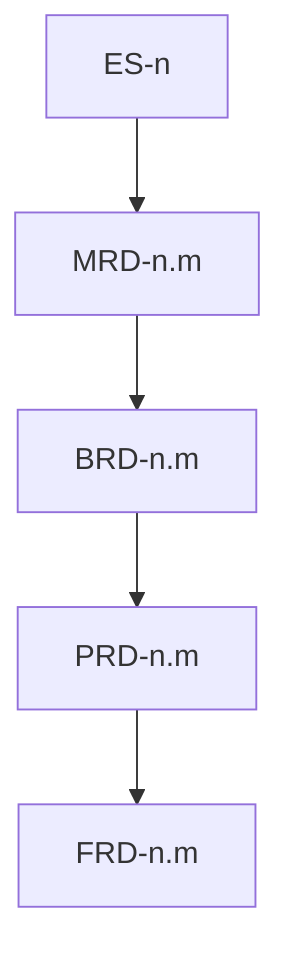

# cascade

**Owner:** Top-down level order, inheritance/narrowing rules, and per-level completion gates.

## Pre-cascade: project posture

Before exec-summary, run [project-posture.md](project-posture.md). Done: that ref's persist condition.

## Level order

Fixed sequence — never skip a level in `standard`/`deep` depth (shallow depth trims per input-resolution):

```
1. exec-summary  — posture, vision, problem, why
2. mrd           — market context
3. brd           — business requirements
4. prd           — product requirements
5. frd           — functional detail
```

Item identity, parent walk, freeze/remap, spec/build: [doc-standards/item-schema.md](doc-standards/item-schema.md).



## Inheritance model

Each level **inherits** all resolved facts from levels above and **narrows** scope:

| Level | Inherits from | Narrows to |
|-------|---------------|------------|
| exec-summary | user input, conversation, confirmed `project_posture` | strategic vision, problem framing, and posture |
| mrd | exec-summary | market segments, competitors, trends relevant to vision |
| brd | exec-summary + mrd | business objectives, stakeholders, constraints |
| prd | exec-summary + mrd + brd | product capabilities, user outcomes, priorities |
| frd | all above | functional behaviors, acceptance criteria, interfaces |

### Inheritance rules

1. **No contradiction** — child facts must align with parent facts. Conflict → [goal-anchor.md](goal-anchor.md) + question (per `question_mode`).
2. **No orphan items** — every item’s `parent:` exists (ES roots: `—`). Cross-doc parent is the previous cascade level only. Verified by `validate_planning.py` (Gate 3 + success-criteria static).
3. **Explicit narrowing** — when a parent fact is too broad for the child level, record the narrowing as a decision in `session-state.json`.
4. **Unknown vs off-level** — details not yet known *at this level* are `assumptions[]` or `open_questions[]`, not silently invented. Off-level content: [note-sessions.md](note-sessions.md).
5. **Priority inheritance** — FRD may default `if_absent` magnitude from parent PRD MoSCoW (Must → high, Should → moderate, Could → low). Won’t PRD items get no FRD children. Do not copy MoSCoW onto FRD. Magnitudes are unchanged; only the human MoSCoW *legend* follows [project-posture.md](project-posture.md).

## Per-level discovery flow (skill-inline)

For each level in `cascade_levels`:

1. Load `doc-standards/<level>.md` and [doc-standards/item-schema.md](doc-standards/item-schema.md).
2. Extract required sections from the standard; treat claims as items (prose overviews stay unnumbered).
3. On level entry, incorporate notes per [note-sessions.md](note-sessions.md).
4. Load [goal-anchor.md](goal-anchor.md) for the **entire** discovery pass.
5. Run progressive discovery:
   - Present inherited facts summary to user (brief), including incorporated notes.
   - Ask targeted questions for gaps in required sections.
   - New items default `spec: idea`; move to `draft` when specifying. Do not auto-promote to `ready`.
   - After every Q&A: classify owner per [note-sessions.md](note-sessions.md); append to `raw-history/{UTC}.yaml`.
   - On reflect trigger → apply [proactivity.md](proactivity.md) (Gate 5; `standard`/`deep` only). PRD after MoSCoW: run the [project-posture.md](project-posture.md) cut-pass once before Gate 6.
6. Accumulate `level_facts` object for compose agent. Compose consumes notes for this `doc_type` only.
7. Invoke compose agent (compose writes `{level}.md|yaml` and merges `items.json`). Confirm overwrite **before first compose** if files exist from a prior run; intra-session re-compose overwrites without asking.
8. Parse slim receipt. While `clarifications_needed[]` non-empty → surface question → append raw-history → merge answer → re-invoke compose (overwrites). Loop until cleared or user says done. Never copy a document body through chat.
9. Read `items.json` to refresh `item_registry`. Run `scripts/validate_planning.py` on `--output-dir` as the static half of Gate 3.
10. Gate 6 per [blind-spots.md](blind-spots.md) skill-inline path.
11. Remaining gates (below). On Gate pass: **freeze** this level (see Freeze and remap) — `frozen_levels` in session-state, not a second write of the doc. Notes on compose/freeze: [note-sessions.md](note-sessions.md).

## Stop and resume

User may stop at any point ("stop", "pause", "done for now", etc.):

1. Leave composed files on disk, including the current unfrozen level (drafts until freeze). Do not rewrite cascade docs. Do not run pre-save reflection.
2. Checkpoint full `session-state.json` to `--output-dir` (include `raw_history_path`, `project_posture`, `note_sessions`, `composed_docs` paths; see [output-formats.md](output-formats.md)). Do not delete `{level}.notes.yaml` sidecars.
3. Set `checkpoint.status: paused` with `current_level` and `pending_clarifications`.

To resume: `rr-planner --resume --output-dir <same-dir>` (or NL "continue planning"). Skill loads checkpoint, appends Q&A to `raw_history_path`, and picks up at `current_level`. Remap uses `item_registry`. Output-dir defaults and old-dir fallback: [input-resolution.md](input-resolution.md).

## Per-level completion gates

A level is **complete** only when all gates pass:

### Gate 1: Section coverage

Every **required section** in the matching doc-standard has at least one resolved fact or explicit assumption marked `blocking: false`.

### Gate 2: Goal anchor

- Zero unresolved unclear or ambiguous statements at this level (always-on [goal-anchor.md](goal-anchor.md)).
- All decisions recorded in `session-state.json` with `goal_ref` (an `ES-*` id when available).
- Nuance captured where user provided qualifiers (not flattened).
- Q&A for this level is in raw-history YAML.

### Gate 3: Inheritance integrity (parent walk)

**Static:** run `validate_planning.py`; criteria owned by [success-criteria.md](success-criteria.md). Do not re-check in the agent.

**Judgment:** [success-criteria.md](success-criteria.md) judgment list (compose/challenge).

### Gate 4: Compose acceptance

- Compose agent returns `status: ok` or user accepted `status: partial` with documented gaps.
- Written doc (already on disk) passes doc-standard **done-when** checklist.
- Skill merged `item_registry` from `items.json` (compose already wrote/merged that file).
- Notes merge/freeze rules: [note-sessions.md](note-sessions.md).

### Gate 5: Proactivity (standard/deep depth only)

- At least one discovery-time reflection pass completed (see [proactivity.md](proactivity.md)).
- Open risks or assumptions surfaced to user before advancing.
- Write-time pre-save reflection is **not** this gate (runs after freeze + success-criteria, all depths; files already on disk).

### Gate 6: Stage-exit blind-spots (all depths)

Execute the skill-inline path in [blind-spots.md](blind-spots.md). Done when that ref's stage-exit rules pass.

## Freeze and remap

| Event | Rule |
|-------|------|
| First compose of a level | Mint dense sibling IDs (`1, 2, 3` / `n.1, n.2`). |
| Cascade gates pass for that level | Add level to `frozen_levels`. IDs freeze. |
| Later insert on a frozen level | Append next integer. Do not renumber existing ids. |
| Explicit re-compose of a frozen level | Allowed. Compose rewrites child-doc `parent:` and `items.json` in the same invocation so e.g. FRD does not point at a vanished `PRD-3`. Skill refreshes `item_registry` from `items.json`. |
| `--resume` | Load `item_registry`; continue minting from max sibling index on frozen levels. |

## Advancing vs stopping

| Condition | Action |
|-----------|--------|
| All gates pass (including Gate 6); no leftover `partial` notes | Freeze level; advance to next cascade level |
| Pending clarifications or gate gaps | Surface question → re-discover or re-compose (no round cap) |
| User says done for level | Accept current state; advance or checkpoint per user intent |
| User requests stop / pause | Checkpoint `session-state.json`; leave files already on disk; skip pre-save; exit cleanly |
| `--resume` | Load checkpoint; append raw-history; continue from `current_level` |

## Session state

Persist and schema: [output-formats.md](output-formats.md) `session-state.json`. Skill updates `level_facts`, `item_registry` (from `items.json` after compose), `frozen_levels`, `project_posture`, `note_sessions`, and `composed_docs` paths across levels. Checkpoint on stop and after each level freeze (`raw_history_path` required once Q&A has started). Compose writes cascade docs and `items.json`; skill does not copy document bodies through chat.
