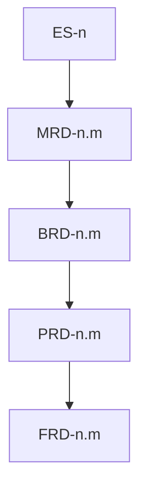

# cascade

**Owner:** Top-down level order, inheritance/narrowing rules, and per-level completion gates.

## Level order

Fixed sequence — never skip a level in `standard`/`deep` depth (shallow depth trims per input-resolution):

```
1. exec-summary  — vision, problem, why
2. mrd           — market context
3. brd           — business requirements
4. prd           — product requirements
5. frd           — functional detail
```

Item identity, parent walk, freeze/remap, spec/build: [doc-standards/item-schema.md](doc-standards/item-schema.md).



## Inheritance model

Each level **inherits** all resolved facts from levels above and **narrows** scope:

| Level | Inherits from | Narrows to |
|-------|---------------|------------|
| exec-summary | user input, conversation | strategic vision and problem framing |
| mrd | exec-summary | market segments, competitors, trends relevant to vision |
| brd | exec-summary + mrd | business objectives, stakeholders, constraints |
| prd | exec-summary + mrd + brd | product capabilities, user outcomes, priorities |
| frd | all above | functional behaviors, acceptance criteria, interfaces |

### Inheritance rules

1. **No contradiction** — child facts must align with parent facts. Conflict → [goal-anchor.md](goal-anchor.md) + question (per `question_mode`).
2. **No orphan items** — every item’s `parent:` exists (ES roots: `—`). Cross-doc parent is the previous cascade level only. Verified by `validate_planning.py` (Gate 3 + success-criteria static).
3. **Explicit narrowing** — when a parent fact is too broad for the child level, record the narrowing as a decision in `session-state.json`.
4. **Deferred detail** — details not yet known at a level are recorded as `assumptions[]` or `open_questions[]`, not silently invented.
5. **Priority inheritance** — FRD may default `if_absent` magnitude from parent PRD MoSCoW (Must → high, Should → moderate, Could → low). Won’t PRD items get no FRD children. Do not copy MoSCoW onto FRD.

## Per-level discovery flow (skill-inline)

For each level in `cascade_levels`:

1. Load `doc-standards/<level>.md` and [doc-standards/item-schema.md](doc-standards/item-schema.md).
2. Extract required sections from the standard; treat claims as items (prose overviews stay unnumbered).
3. Load [goal-anchor.md](goal-anchor.md) for the **entire** discovery pass. Unclear or ambiguous statements are blocking.
4. Run progressive discovery:
   - Present inherited facts summary to user (brief).
   - Ask targeted questions for gaps in required sections.
   - New items default `spec: idea`; move to `draft` when specifying. Do not auto-promote to `ready`.
   - Unclear/ambiguous input → disambiguate per goal-anchor; do not record as fact until resolved or accepted as `assumption`.
   - After every Q&A, append to `raw-history/{UTC}.yaml`.
   - On reflect trigger → apply [proactivity.md](proactivity.md) (Gate 5; `standard`/`deep` only).
5. Accumulate `level_facts` object for compose agent; keep `item_registry` in sync after compose.
6. Invoke compose agent.
7. While `clarifications_needed[]` non-empty → surface question → append raw-history → merge answer → re-invoke compose. Loop until cleared or user says done.
8. Stage-exit blind-spots (Gate 6): load [blind-spots.md](blind-spots.md); scan **this level's** `in_scope` + `inherit_check` only. `critical`/`high` → question before freeze. Do not spawn the challenge agent.
9. Remaining gates (below). On Gate pass: **freeze** this level (see Freeze and remap). Run `scripts/validate_planning.py` on `--output-dir` as the static half of Gate 3.

## Stop and resume

User may stop at any point ("stop", "pause", "done for now", etc.):

1. Write partial composed docs for **frozen** levels plus `items.json`. Do not run pre-save reflection.
2. Checkpoint full `session-state.json` to `--output-dir` (include `raw_history_path`; see [output-formats.md](output-formats.md)).
3. Set `checkpoint.status: paused` with `current_level` and `pending_clarifications`.

To resume: `rr-planner --resume --output-dir <same-dir>` (or NL "continue planning"). Skill loads checkpoint, appends Q&A to `raw_history_path`, and picks up at `current_level`. Remap uses `item_registry`. Default dir is `{PROJECT_ROOT}/docs/plans/`; old `docs/planning/` fallback is in [input-resolution.md](input-resolution.md).

## Per-level completion gates

A level is **complete** only when all gates pass:

### Gate 1: Section coverage

Every **required section** in the matching doc-standard has at least one resolved fact or explicit assumption marked `blocking: false`.

### Gate 2: Goal anchor

- Zero unresolved unclear or ambiguous statements at this level (always-on [goal-anchor.md](goal-anchor.md)).
- All decisions recorded in `session-state.json` with `goal_ref` (an `ES-*` id when available).
- Nuance captured where user provided qualifiers (not flattened).
- Q&A for this level is in raw-history YAML.

### Gate 3: Inheritance integrity (parent walk)

**Static** (`scripts/validate_planning.py` — do not re-check in the agent):

- Every `parent` / `supersedes` / `superseded_by` id exists (ES roots `—`).
- No cycles; no cascade-level skips; numbering dense among siblings; max depth 2.
- Kind invariant (container has children, leaf has none); `idea` has no children.
- Required keys, spec/build legality, md|yaml vs `items.json` drift.

**Judgment** (compose/challenge): compound leaves, inflated MoSCoW, weak triad prose, vague AC.

### Gate 4: Compose acceptance

- Compose agent returns `status: ok` or user accepted `status: partial` with documented gaps.
- Written doc passes doc-standard **done-when** checklist.
- `items[]` emitted; skill merged into `item_registry` and `items.json`.

### Gate 5: Proactivity (standard/deep depth only)

- At least one discovery-time reflection pass completed (see [proactivity.md](proactivity.md)).
- Open risks or assumptions surfaced to user before advancing.
- Write-time pre-save reflection is **not** this gate (runs after freeze + success-criteria, all depths).

### Gate 6: Stage-exit blind-spots (all depths)

- One skill-inline pass against this level's applicability row in [blind-spots.md](blind-spots.md) (`in_scope` + `inherit_check` only).
- Every `critical` / `high` finding is resolved, re-composed, or explicitly accepted before freeze.
- `medium` / `low` recorded as assumptions or open questions; do not block unless the user wants them.
- No per-level `challenge-report`. `--challenge` is a later union scan.

## Freeze and remap

| Event | Rule |
|-------|------|
| First compose of a level | Mint dense sibling IDs (`1, 2, 3` / `n.1, n.2`). |
| Cascade gates pass for that level | Add level to `frozen_levels`. IDs freeze. |
| Later insert on a frozen level | Append next integer. Do not renumber existing ids. |
| Explicit re-compose of a frozen level | Allowed. Rewrite parent refs in **child** docs and in `item_registry` / `items.json` so e.g. FRD does not point at a vanished `PRD-3`. |
| `--resume` | Load `item_registry`; continue minting from max sibling index on frozen levels. |

## Advancing vs stopping

| Condition | Action |
|-----------|--------|
| All gates pass (including Gate 6) | Freeze level; advance to next cascade level |
| Pending clarifications or gate gaps | Surface question → re-discover or re-compose (no round cap) |
| User says done for level | Accept current state; advance or checkpoint per user intent |
| User requests stop / pause | Checkpoint `session-state.json`; write frozen docs + `items.json` + raw-history; skip pre-save; exit cleanly |
| `--resume` | Load checkpoint; append raw-history; continue from `current_level` |

## Fact accumulation schema

Skill maintains across levels:

```json
{
  "decisions": [{ "id": "d1", "level": "exec-summary", "text": "", "goal_ref": "ES-1", "timestamp": "" }],
  "assumptions": [{ "id": "a1", "level": "mrd", "text": "", "blocking": false, "goal_ref": "ES-2" }],
  "level_facts": {
    "exec-summary": {},
    "mrd": {},
    "brd": {},
    "prd": {},
    "frd": {}
  },
  "composed_docs": {
    "exec-summary": "",
    "mrd": "",
    "brd": "",
    "prd": "",
    "frd": ""
  },
  "item_registry": {
    "PRD-3": {
      "doc": "prd",
      "parent": "BRD-2",
      "kind": "container",
      "spec": "draft",
      "class": null
    }
  },
  "frozen_levels": ["exec-summary", "mrd"],
  "checkpoint": {
    "status": "in_progress|paused|complete",
    "current_level": "brd",
    "pending_clarifications": [],
    "question_mode": "ask",
    "updated": "ISO-8601"
  },
  "raw_history_path": "raw-history/2026-08-15T185203Z.yaml"
}
```

`item_registry` maps every minted id → `{ doc, parent, kind, spec, class? }` so resume and re-compose can remap child `parent:` values.

Checkpointed to `--output-dir/session-state.json` on stop and after each level completion (`raw_history_path` required once Q&A has started). Resume loads this file.
