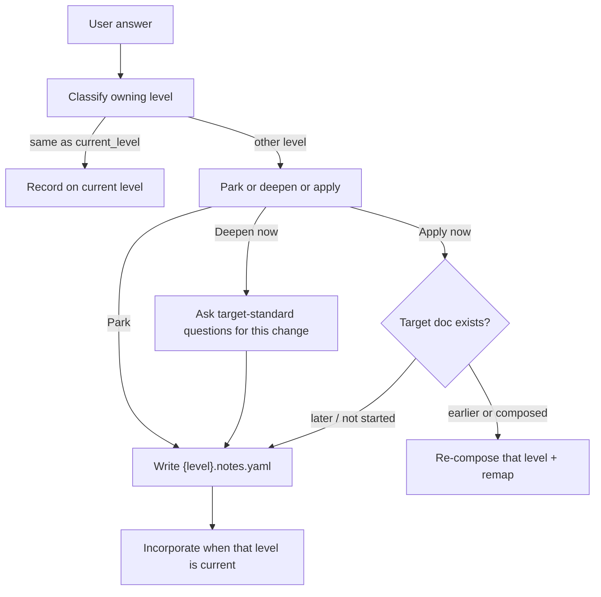

# note-sessions

**Owner:** Classify off-level answers, park them on the **affected** document, and incorporate them when that level is current. Source of truth for park / deepen / apply.

**Load when:** After every user answer (and free-form volunteer) during discovery; on level entry (load sidecar); before Gate 4 / freeze.

A PRD answer given during exec-summary must live on PRD, not as an ES assumption. Completing questions for a later doc ≠ composing or freezing that doc.

## Classify, then route

After every user answer, classify which cascade level owns it using that level's doc-standard sections.

| Owner | Action |
|-------|--------|
| Same as `current_level` | Record on current discovery (`level_facts`) |
| Other level | Do **not** record as a current-level fact. Park, deepen, or apply (below). |
| Ambiguous | Goal-anchor: "which document?" — [goal-anchor.md](goal-anchor.md) |



## Where notes live

Owned by the **affected** document, not a global inbox.

- Sidecar `{output-dir}/{level}.notes.yaml` — always YAML, like raw-history. Not selected by `--format`. Not an item. Not validator input.
- Mirror index in `session_state.note_sessions[level][]` for resume.
- Do **not** inject parked prose into composed item headings (closed vocabulary / validator).

Stub the sidecar as soon as the first off-level note for that doc appears, even if `prd.md` does not exist yet.

```yaml
doc_type: prd
status: parked
notes:
  - id: n-001
    captured_at: ISO-8601
    captured_during: exec-summary
    section: features
    text: "Guest checkout without account"
    completeness: partial   # or ready_to_incorporate
    pending_questions: []
    source_turn: raw-history/2026-08-15T185203Z.yaml#turn-12
```

| Field | Notes |
|-------|-------|
| `doc_type` | Cascade level that owns the note (`exec-summary` … `frd`) |
| `status` | Sidecar: `parked` \| `incorporated` |
| `notes[].id` | `n-NNN` within that sidecar |
| `captured_during` | `current_level` when captured |
| `section` | Target doc-standard section (e.g. `features`, `vision`) |
| `completeness` | `partial` (still needs questions) \| `ready_to_incorporate` |
| `pending_questions` | Remaining target-standard questions for this change only |
| `source_turn` | Pointer into raw-history; verbatim Q&A stays there |

### Session index

```json
{
  "prd": [
    {
      "id": "n-001",
      "sidecar": "prd.notes.yaml",
      "completeness": "partial",
      "captured_during": "exec-summary"
    }
  ]
}
```

Decision when routed: `type: note_routed`, `level` = owning doc, `goal_ref` as usual.

## User paths (AskQuestion, one shot)

| Option | What happens | When to use |
|--------|----------------|-------------|
| **Park for later** | Write/append the note; stay on `current_level`. | Default. User is mid-vision and mentioned a feature. |
| **Ask remaining questions now** | Load the **target** doc-standard extraction method for *this change only* (not the whole level). Ask until the note is `ready_to_incorporate` or the user stops. Still do **not** compose/freeze a later level. Then park. | User wants the other doc's change fully specified so later incorporation is not a game of telephone. |
| **Apply to the other doc now** | Allowed only if that doc already exists (composed or frozen). Re-compose that level; remap children if frozen. If the target is a **later** unstarted level → refuse apply, fall through to deepen+park. | User is on FRD and changes ES vision; or PRD exists and they want the edit now. |

Do not skip cascade: parent pointers still require the parent level to exist at compose time.

## Incorporate when the document is the target

When discovery enters a level:

1. Load `{level}.notes.yaml` if present.
2. Present parked notes as the first inherited-facts slice (before asking new questions).
3. Promote each `ready_to_incorporate` note into `level_facts` (then items on compose). `partial` notes become the first questions.
4. User may discard a note (record `type: note_routed` decision, discarded).
5. On successful compose of that level: set sidecar `status: incorporated` (or clear it); remove those ids from `note_sessions`.

Compose consumes notes for the **current** `doc_type` only. Do not mint items from another level's sidecar.

## Gates

| Gate | Rule |
|------|------|
| Record | Off-level content is never a current-level fact, assumption, or open question. |
| Gate 4 | `ready_to_incorporate` notes for this level must be merged or discarded before compose acceptance. |
| Freeze | A level cannot freeze while it still has `partial` notes the user has not discarded or completed. |
| Apply | Later unstarted level → refuse; deepen+park instead. |

## Failure modes this blocks

- FRD shalls recorded as exec-summary facts
- Losing a feature the user mentioned at the wrong time
- Composing PRD/FRD before parents exist because the user volunteered a story
- Re-asking the same content when the cascade finally reaches that level
