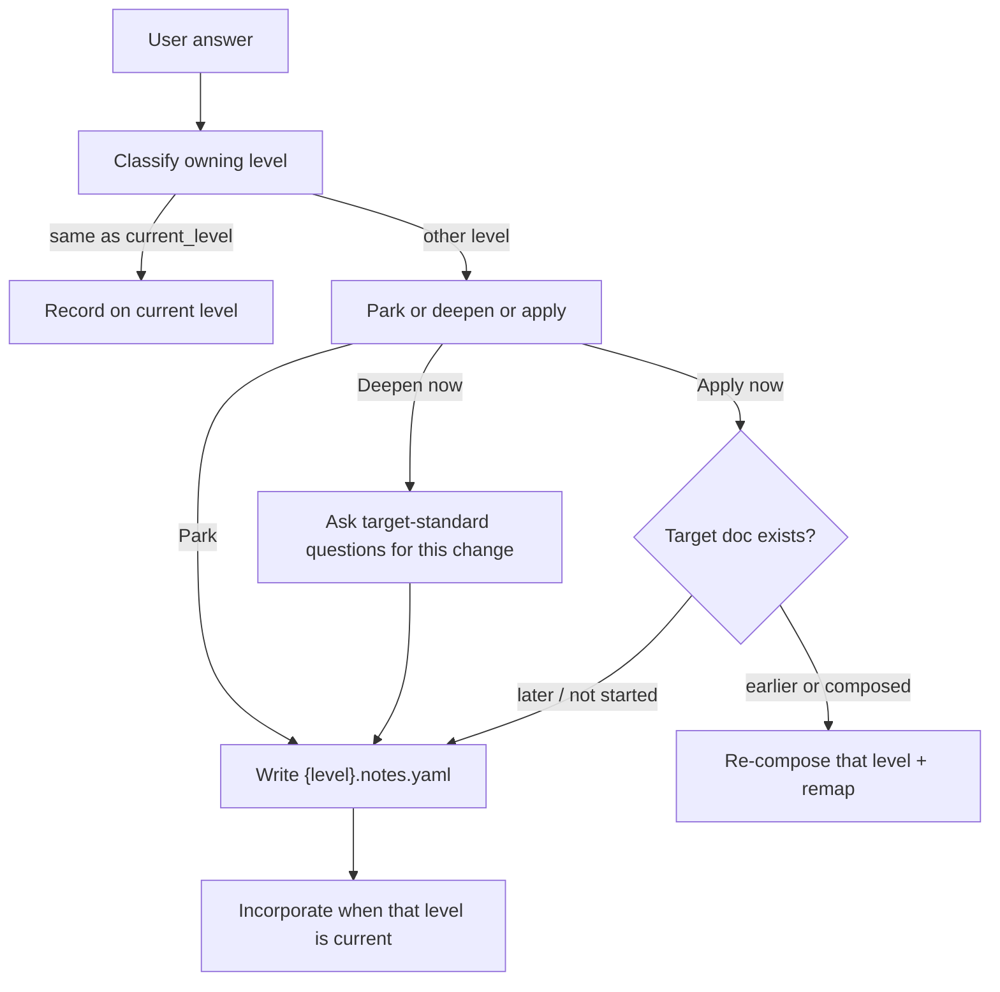
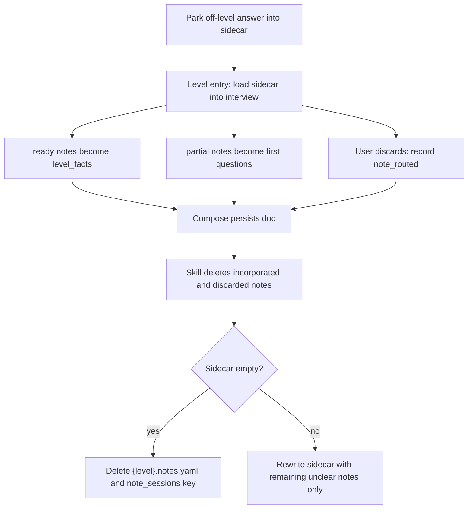

# note-sessions

**Owner:** Classify off-level answers, park them on the **affected** document, and incorporate them when that level is current. Source of truth for park / deepen / apply **and** sidecar prune.

**Load when:** After every user answer (and free-form volunteer) during a Plan session; on Plan level entry (load sidecar into interview); after compose persist (prune); before Gate 4 / freeze.

A later-level answer given mid-PRD (or during standing-arch) must live on that owner doc, not as a current-level fact. Completing questions for a later doc ≠ composing or freezing that doc.

## Classify, then route

After every user answer, classify which cascade level owns it using that level's doc-standard sections.

| Owner | Action |
|-------|--------|
| Same as `current_level` | Record on current Plan level (`level_facts`) |
| Other level | Do **not** record as a current-level fact. Park, deepen, or apply (below). |
| Ambiguous | Goal-anchor: "which document?" — [goal-anchor.md](goal-anchor.md) |



## Where notes live

Owned by the **affected** document, not a global inbox. Same write / load / unload for every cascade level (`executive-summary` … `prd`). `{level}` is the only variable — no ES/PRD special case.

| Event | Same rule for every `{level}.notes.yaml` |
|-------|------------------------------------------|
| Write | Stub/append on first off-level note for that `doc_type`, even if `{level}.md` does not exist yet. |
| Load | On that level's entry: interview-load that file (mandatory). |
| Unload | After that level's compose persist: prune merged/discarded; delete the file if empty. Other levels' files untouched. |

- Sidecar `{output-dir}/{level}.notes.yaml` — always YAML, like raw-history. Not selected by `--format`. Not an item. Not validator input. **File presence means unfinished notes.**
- `future.md` is not a notes sidecar. Unassigned / beyond-next only (`refs/planning/output-formats.md`). If `status.yaml.next` is already open, park notes for that track in `{level}.notes.yaml` under `docs/plan/{next}/` — do not duplicate into `future.md`.
- Mirror index in `session_state.note_sessions[level][]` for resume.
- Do **not** inject parked prose into composed item headings (closed vocabulary / validator).

```yaml
doc_type: prd
status: parked
notes:
  - id: n-001
    captured_at: ISO-8601
    captured_during: executive-summary
    section: features
    text: "Guest checkout without account"
    completeness: partial   # or ready_to_incorporate
    pending_questions: []
    source_turn: raw-history/2026-08-15T185203Z.yaml#turn-12
```

| Field | Notes |
|-------|-------|
| `doc_type` | Cascade level that owns the note (`executive-summary` … `prd`) |
| `status` | Sidecar: `parked` only. No `incorporated` tombstone — delete resolved notes instead. |
| `notes[].id` | `n-NNN` within that sidecar |
| `captured_during` | `current_level` when captured |
| `section` | Target doc-standard section (e.g. `features`, `vision`) |
| `completeness` | `partial` (still needs questions) \| `ready_to_incorporate` |
| `pending_questions` | Remaining target-standard questions for this change only |
| `source_turn` | Pointer into raw-history; verbatim Q&A stays there |

### Session index

```json
{
  "prd": [
    {
      "id": "n-001",
      "sidecar": "prd.notes.yaml",
      "completeness": "partial",
      "captured_during": "executive-summary"
    }
  ]
}
```

Decision when routed: `type: note_routed`, `level` = owning doc, `goal_ref` as usual. Provenance of park / discard / merge stays in `raw-history` + these decisions — not in a sidecar status.

## User paths (AskQuestion, one shot)

| Option | What happens | When to use |
|--------|----------------|-------------|
| **Park for later** | Write/append the note; stay on `current_level`. | Default. User is mid-vision and mentioned a feature. |
| **Ask remaining questions now** | Load the **target** doc-standard extraction method for *this change only* (not the whole level). Ask until the note is `ready_to_incorporate` or the user stops. Still do **not** compose/freeze a later level. Then park. | User wants the other doc's change fully specified so later incorporation is not a game of telephone. |
| **Apply to the other doc now** | Allowed only if that doc already exists (composed or frozen). Re-compose that level; remap children if frozen. If the target is a **later** unstarted level → refuse apply, fall through to deepen+park. | User is on PRD and changes ES vision; or BRD exists and they want the edit now. |

Do not skip cascade: parent pointers still require the parent level to exist at compose time.

## Interview on level entry

When Plan enters a level (`docs/plan/` `current_level`), **before** new doc-standard questions:

1. Load `{level}.notes.yaml` if present. Mandatory — not optional presentation.
2. Walk every note:
   - `ready_to_incorporate` → promote into `level_facts` (then items on compose). Do not re-ask notes already in `level_facts`.
   - `partial` → first questions for that section.
   - User may discard (record `type: note_routed`, discarded).
3. Do not start the rest of the doc-standard questionnaire until parked notes are addressed or explicitly kept as still-unclear.



## Prune after compose persist

After compose persist of **this** level (`ok` or `partial`; skip on `failed` / no write):

1. Skill deletes notes that were merged into `level_facts` or discarded. Other levels' sidecars are untouched.
2. If none remain: **delete the file** and drop that key from `session_state.note_sessions`.
3. If some notes are still unclear: rewrite the sidecar with only those notes (`status: parked`).

Compose may ingest current-level ready notes as a backstop. Compose must not write or delete sidecars. Skill owns prune after the receipt.

Pause / resume: keep remaining sidecars. Do not re-ask notes already in `level_facts`. Pause never deletes remaining sidecars.

Freeze: a level cannot freeze while leftover `partial` notes exist unless discarded or completed. Happy path after freeze: this level's sidecar is gone.

## Rules

`Gate N` is exclusive to [cascade.md](cascade.md). This table does not number cascade gates.

| Rule | When |
|------|------|
| Record | Off-level content is never a current-level fact, assumption, or open question. |
| Pre-compose | `ready_to_incorporate` notes for this level must be merged or discarded before compose acceptance (cascade Gate 4). |
| After persist | Resolved notes are gone from the sidecar (merged and discarded deleted). Empty file → delete + drop `note_sessions` key. Skip on `failed` / no write. |
| Freeze | A level cannot freeze while it still has `partial` notes the user has not discarded or completed. |
| Apply | Later unstarted level → refuse; deepen+park instead. |

## Failure modes this blocks

- Mechanism detail recorded as executive-summary facts instead of `tech.md`
- Losing a feature the user mentioned at the wrong time
- Composing PRD before parents exist because the user volunteered a story
- Re-asking the same content when the cascade finally reaches that level
- Leftover `{level}.notes.yaml` after compose so the next session re-asks or double-ingests parked prose
