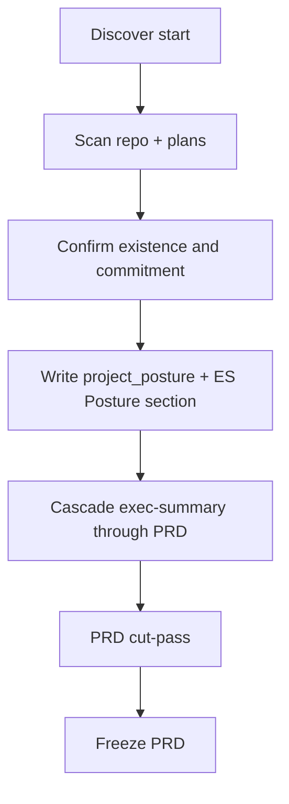

# project-posture

**Owner:** Pre-cascade classification of product existence and commitment, MoSCoW legend, the PRD cut-pass, and `domain_context` for the panel. Horizon is a session fact; MoSCoW is priority *within* that horizon.

**Load when:** Discover start, before exec-summary. Resume skips confirm if `session_state.project_posture` is already `user_confirmed: true` and the user has not contradicted it.

MoSCoW is not a second rank and is not an item field. Remap the *legend* only. Do not add `horizon:` on items. Do not skip MRD/BRD for `signed_v1` — change the questions, not the cascade.

## Axes

Two independent axes. Do not collapse into a 3-way enum.

| Axis | Values | Meaning |
|------|--------|---------|
| `existence` | `greenfield` \| `existing` | Is there a product in production (or equivalent shipped behavior)? |
| `commitment` | `unsigned` \| `signed_v1` | Is this session's Must set still negotiable, or already locked? |

`source`: `inferred` (scan) until confirm, then `user_confirmed`. Implied fact is not fact — [goal-anchor.md](goal-anchor.md).

## 2×2 and MoSCoW legend



| | `unsigned` (scope negotiable) | `signed_v1` (scope locked) |
|--|--|--|
| **greenfield** | Must = this MVP slice. Should = v1 after MVP. Could = later. Won't = never. | Must = committed v1 — do not re-cut. Should/Could = v1+. New Must requires an explicit scope-change decision. |
| **existing** | Same cut rules, but shipped behavior is **constraint / non-goal**, not a feature to build. MVP = next viable increment. | Must = signed remainder + already-committed. Discovery is gaps + v1+. Do not re-litigate shipped or signed Must. |

Won't = never. Later = Should/Could. Do not use Won't for "later."

Release-phasing prose **must** state which legend was used. Compose and challenge read `session_state.project_posture`.

## Detection protocol

Lightweight scan, then **confirm**. Ask-only misses brownfield; silent scan treats inference as fact.

### 1. Scan (max 1–2 cheap checks, not research)

Record a candidate with `source: inferred`. Do not write `user_confirmed: true`.

| Signal | Lean |
|--------|------|
| Git history / substantial `src` / app manifests (`package.json`, `pom.xml`, `*.csproj`, etc.) | `existing` |
| Empty or scaffold-only tree | `greenfield` |
| Existing `docs/plans/` with frozen PRD Must set or a named contract | `signed_v1` candidate |

Stop after two checks. Do not inventory the codebase.

### 2. Confirm

Surface via `question_mode` (`AskQuestion` / text). Options:

- Greenfield unsigned
- Greenfield signed v1
- Existing unsigned
- Existing signed v1
- Other (capture nuance)

NL tokens `greenfield`, `brownfield`, `existing`, `signed v1` in the prompt **seed** this confirm. They are not a primary action flag — [input-resolution.md](input-resolution.md).

In the same confirm turn (or immediately after), capture `domain_context` — required for the panel ([expert-panel.md](expert-panel.md)):

| Field | Ask | Values |
|-------|-----|--------|
| `industry` | What industry does this problem live in? | Free text (e.g. mid-market 3PL) |
| `buyer_archetype` | Who pays / who is accountable? | Free text (e.g. CFO; platform eng manager) |
| `regulatory_regime` | Binding regime? | Named regime or `none` |
| `market_type` | External product or internal platform? | `external` \| `internal` |

Do not invent an industry to fill the shape. Missing `market_type` is blocking — internal work has no TAM and the MRD sizing gate is a different procedure.

### 3. Follow-ups (one each, only if applicable)

| Posture | Ask | Record as |
|---------|-----|-----------|
| `existing` | What is already shipped vs what this session is for? | ES constraints / non-goals — **not** PRD features |
| `signed_v1` | What is in the signed set? (pointer to contract, prior PRD, or user list) | Those IDs become Must; do not offer them for demotion |

### 4. Persist

1. `session_state.project_posture` (schema below), including `domain_context`.
2. Exec-summary **Posture** section — docs are source of truth for challenge. Do not mint an `ES-*` id for it.
3. Decision log: `type: project_posture`, `user_confirmed: true`.

### 5. Resume

`--resume`: do not re-ask unless the user contradicts the stored posture. Contradiction → re-confirm, rewrite the Posture section, log a new `project_posture` decision.

## Session field

```json
{
  "existence": "greenfield",
  "commitment": "unsigned",
  "source": "user_confirmed",
  "user_confirmed": true,
  "signed_set": [],
  "shipped_summary": null,
  "domain_context": {
    "industry": "mid-market 3PL",
    "buyer_archetype": "CFO",
    "regulatory_regime": "none",
    "market_type": "internal"
  }
}
```

| Field | Notes |
|-------|-------|
| `existence` / `commitment` | Required after confirm |
| `source` | `inferred` until confirm, then `user_confirmed` |
| `signed_set` | Item ids or contract pointers when `signed_v1`; else `[]` |
| `shipped_summary` | One-line shipped-vs-session when `existing`; else `null` |
| `domain_context` | Required after confirm. Instantiates the domain-practitioner seat and selects the internal vs external ES premise test and MRD sizing gate ([expert-panel.md](expert-panel.md)). |

## Cut-pass (PRD, after MoSCoW, before Gate 6)

This is the "how to prioritize" procedure — not a new rank. One pass per PRD compose (same fatigue rule as Gate 5). User may accept the cut as-is.

Load this ref when PRD MoSCoW is assigned. Fire from [proactivity.md](proactivity.md).

### `unsigned`

1. List Must. "If we ship only these, does an ES success metric still move?" Fail → demote to Should or Won't.
2. List Should. "Does any of this secretly make the Must slice unusable?" Yes → Must or split the story.
3. Should + Could = v1+ bucket in release-phasing prose. Won't stays never, not "later."

### `signed_v1` — invert the questions

1. Confirm the committed Must set. Do **not** ask "is this MVP?"
2. "What is already signed that we must not reopen?"
3. Remaining work is v1+ vs never (Should/Could vs Won't).
4. New Must after signed posture → `type: scope_change` decision or reject (inflation).

### `existing` (either commitment)

Inventory shipped capabilities as constraints first. Failure mode to block: restating current behavior as Must features to implement.

## Cascade impact

| Do | Do not |
|----|--------|
| Run the full level list (depth still trims) | Skip MRD/BRD because v1 is signed |
| Ask market/business questions as *constraints on the increment* when `existing` / `signed_v1` | Re-open a locked Must set |
| Cite the legend in PRD release-phasing | Store a second rank on items |

Off-level answers (feature volunteered during vision, etc.): [note-sessions.md](note-sessions.md) — not an ES assumption.

## Failure modes this blocks

- Planning an existing signed v1 as a greenfield MVP (Must inflation, re-litigating committed scope)
- Dumping v1+ into Must because "important"
- Using Won't for "later"
- Restating production behavior as features to build
